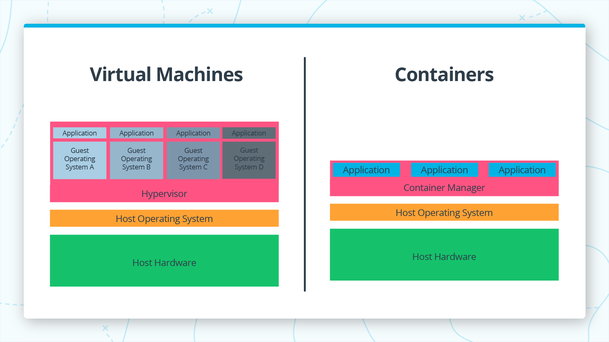
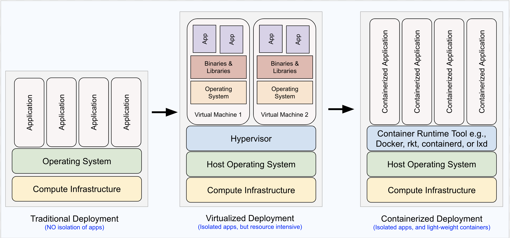
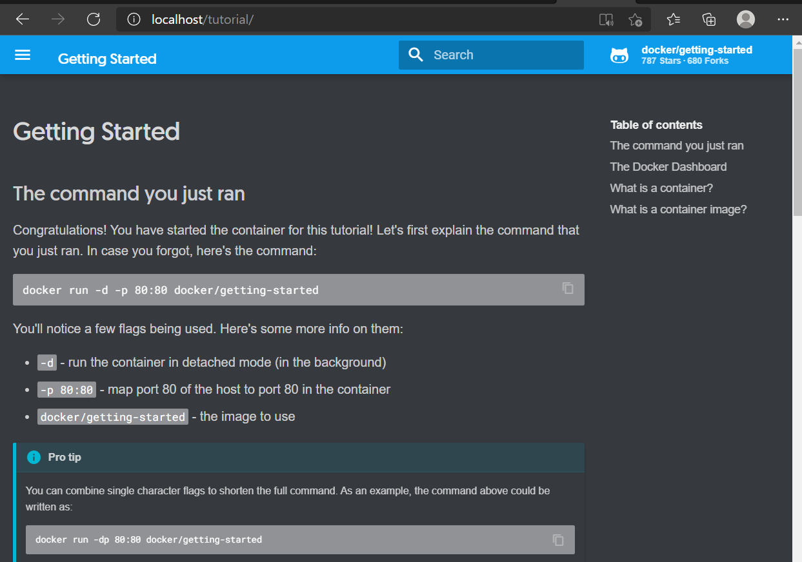

# Containers vs. Virtual Machines




## Benefits of using Containers versus VMs
There are several benefits of using Containers over VMs:

- Size: Containers are much smaller than Virtual Machines (VM) and run as isolated processes versus virtualized hardware. VMs can be in GBs while containers are in MBs.
- Speed: Virtual Machines can be slow to boot and take minutes to launch. A container can spawn much more quickly typically in seconds.
- Composability: Containers are designed to be programmatically built and are defined as source code. Virtual Machines are often replicas of a conventional computer system.




## What is Docker?
- Docker is the most popular open-sourced container runtime tool that helps to build, test, and run containers. It is both a container system and a company.

- Using Docker, you can create containers with both Linux and Windows kernels, although Windows containers are only available if you are running a Windows machine. In either case (Linux/Windows), you will have to install Docker on your local machine. **Installing Docker means installing ** Docker Desktop, a command-line utility.

### How to install Docker Desktop?
Installing Docker means installing Docker Desktop, a command-line utility. There are installers available for all the major operating systems: Linux, OSX, and Windows. You can find installers at either of the below links which are part of the official Docker documentation:

- [Get Docker](https://docs.docker.com/get-docker/)
- [Docker Desktop overview](https://docs.docker.com/desktop/)
- [Docker for Mac](https://docs.docker.com/desktop/install/mac-install/)

### Verify the Docker installation
You can run either of the following commands in your Mac terminal / WSL terminal:

```python

# to check the version
docker version
# to verify that Docker can pull and run images (we will talk more about images next)
docker run hello-world 
```

### Optional - Create a container to learn more about Docker
You can try the following command that will fetch an image and then create and run a container.

docker run -d -p 80:80 docker/getting-started
We will learn more in detail about the command above, but for now, it fetches an image docker/getting-started and creates and runs a container. You can access this container using http://localhost:80 in your browser. See a snapshot below:




### Docker Concepts

https://www.youtube.com/watch?v=UVeABQg9t18&t=63s

Let's understand a few terms before we dive deeper:

#### Docker Engine
Docker Engine is an application that consists of a daemon, an API, and a client:
- The Docker daemon is a server that manages the images, containers, networks, and volumes.
- The Docker client is the user interface for Docker. The client is a CLI, so most of the work you do with Docker will take place at the command line.

The client communicates with the daemon through the command line API as shown in the image below. You will be using the Docker Engine to create and run containers, so if you have not installed Docker using the links above, please be sure to do so.

#### Docker Image
A Docker image is the set of instructions for creating a container. The image typically includes a file system and the parameters that will be used for the container.

#### Docker Container
You have already been introduced to containers, and a Docker container is just the Docker-specific implementation of the concept. In practice, Docker containers are created from Docker images - a container is a runnable instance of an image. Note that since the image is a set of instructions for creating a container, multiple containers can be created from the same image. 

#### Docker Registry
Docker images can be stored and distributed using a Docker registry. In the next classroom concept, you will download and run an image from DockerHub, which is a free registry with many images you can use.


### How does it work?

Let me give you an overview of the flow of execution for creating a container:

Dockerfile → Docker Image → Docker container

The steps shown above are: 1. **Write a Dockerfile**:
It is a text document that contains the commands a user would execute on the command line to assemble an image. In this file, you can specify the necessary environments and dependencies. For example, see a Dockerfile below: ```bash # Pull the "tomcat" image. The community maintains this image. FROM tomcat # Copy all files present in the current folder to the "/usr/local/tomcat/webapps" folder COPY ./*.* /usr/local/tomcat/webapps ``` In the example above, every time you create a container, it will have the tomcat web server installed. In addition, all the contents of the current directory will also be copied to the */usr/local/tomcat/webapps* folder of each container. See another Dockerfile [example here](https://github.com/docker/labs/blob/master/beginner/static-site/Dockerfile). 
**We will learn more about the Dockerfile and practice writing them on the upcoming page.** For now, see the [Dockerfile reference](https://docs.docker.com/engine/reference/builder/) for possible commands you can use. 


#### Build an Image:
Use the docker build command to build an image from the Dockerfile. Usually, we execute this command from the same directory where the Dockerfile is present.
# This command will look for a Dockerfile in the `pwd`, and create myImage
docker build  --tag myImage  [OPTIONS] path_where_to_store_the_image 

#### Key Terms
Term:	Definition
- Dockerfile:	A file containing instructions on how to translate an application into an image that can be run in containers
- Base Image:	A set of common dependencies built into a Docker image that acts as a starting point to build an application’s Docker images to reduce build times
- Image:	A snapshot of dependencies and code used by Docker containers to run an application
- Container:	Grouped software dependencies and packages that make it easier and more reliable to deploy software
- DockerHub:	A centralized place (online) to store and share Docker images.
- Docker Registry:	An application that stores and lets you distribute Docker images.

## DockerHub

DockerHub is the world’s largest registry of Docker images with more than 100,000 images available. DockerHub is the default registry for Docker. It contains images ready to run a great variety of applications.

### Fetch the image - Pull the latest postgress
#Pull the lastest postgres from DockerHub to your local

`docker pull postgress:latest`

### Create and run a conatiner - Run the postgress image 
`docker run --name psql -e POSTGRES_PASSWORD=P@ssw0rd -p 5433:5432 -d postgres:latest`

In the command above:

The `--name` flag allows you to specify a name for the container that can be used later to reference the container. If you don’t specify a name, Docker will assign a random string name to the container.
The `-e` flag stands for “environment”. This sets the environment variable POSTGRES_PASSWORD to the value password!.
The `-p` flag stands for “publish”. This allows you to bind your local machine’s port 5433 to the container port 5432.
The `-d` stands for “detach”. This tells Docker run the indicated image in the background and print the container ID. When you use this command, you will still be able to use the terminal to run other commands, otherwise, you would need to open a new terminal.

### Check the running container
`docker ps`

CONTAINER ID   |   IMAGE   |      COMMAND       |      CREATED   |    STATUS    |    PORTS        |       NAMES    |
| ------------- | ------------- |  ------------- | ------------- |  ------------- |  ------------- | ------------- | 
| 274180a9eb73   | postgres:latest  |  "docker-entrypoint.s…"  | 2 minutes ago |  Up 2 minutes  | 0.0.0.0:5433->5432/tcp  | psql |

### Connect to the container - Connect the Postgress

```python
psql -h 127.0.0.1 -p 5433 -U postgres

# Mac/Linux users can also connect from the 0.0.0.0 address
psql -h 0.0.0.0 -p 5433 -U postgres
```

This command allows you to access the database using the same port that you exposed earlier. Note that after running that command you will need to enter the same password that you set with the POSTGRES_PASSWORD when creating the container (password!).

### Test Container with SQL commands

- List all databases using `\l` command or
- List all tables (relations) using the `\dti` command.
- More commands can be found in the Postgres documentation here: 
    + https://github.com/nguyentrongphuc/Document/blob/master/Repositories/postgres/README.md
    + https://www.postgresql.org/docs/current/app-psql.html

- When you are finished testing Postgres, you can quit your connection to Postgres using `\q`


### Clean-up container
```python
#List all containers
docker ps --all
# Stop
docker stop <container_ID>
docker stop <container_name>

# Start an existing container which is stopped 
docker start <container_ID>
docker start <container_name>

# Remove
docker container rm <container_ID>
```

Similarly, you can view the images in your local system, and remove anyone as:
```python
# List all images
docker image ls
# Remove
docker image rm <image_ID>
```

## Dockerfiles 

Dockerfiles are text files used to define Docker images. They contain commands used to define a source or parent image, copy files to the image, install software on the image, and define the application which will run when the image is invoked.


### Dockerfile Command Glossary

- Dockerfile comments start with `#`.
- `FROM` defines source image upon which the image will be based.
- `COPY` copies files to the image.
- `WORKDIR` defines the working directory for other commands.
- `RUN` is used to run commands other than the main executable.
- `ENTRYPOINT` is used to define the main executable.

```pyhton
FROM python:3.7.2-slim

COPY . /app
WORKDIR /app

RUN pip install --upgrade pip
RUN pip install flask

ENTRYPOINT [“python”, “app.py”]
```

### Example 1
#### 1. Create an empty Dockerfile In a new directory for this exercise, create a file named Dockerfile. Note that a Dockerfile does not have any file extensions.

Mac/Linux/Windows users using WSL/GitBash can use the following commands:
```python
# create a new directory
mkdir Example1
cd Example1
# create a file in the present working directory
touch Dockerfile
# open the file in any text editor, such as VS Code
code .
```

#### 2. Write Dockerfile content In the Dockerfile, add the lines

```python
FROM python:3.7.2-slim

ENTRYPOINT ["echo", "hello simple dockerfile"]
```

#### 3. Build an image Build the image from the same directory using the command
```terminal
docker build --tag test .
```

Here, the image name is "test". Note that the full stop (.) tells the docker build command to use the Dockerfile found in the current directory.

#### 4. Create and run a container: Once the image is built, you can run the container with the command:

`docker run --name myContainer  test --rm`

where, 
- `--rm` option ensures that the container is removed when it exits.
- `myContainer` you name it
- `test` is imange's name

#### 5. Clean up - Stop and remove the container:
```terminal
docker ps -a
docker container stop <container_ID>
docker container rm <container_ID>
docker container rm <container_name>
```

### Example 2

#### 1. See example in /examples/flaskapp/
Navigate to flaskapp 

#### 2. Build an image
`docker build -t test .`

Here, the `-t` flag is an alternate way of writing `--tag`. Don't forget to put a period (`.`) at the end of the command. It tells the build command to look out for the Dockerfile in the current directory. Check the list of images:

`docker image ls`

#### 3. Create and run a container
Use the "test" image to create and run the container "myContainer":

`docker run --name myContainer  -p 80:8080 test`

In this command, you are mapping port 80 of your local machine to the port 8080 of the container running the flask application. If your port 80 is already in use by other application, feel free to use any other port number, such as 9090.

#### 4. Access the application
Open a new terminal, and Curl the endpoint
```terminal
# Mac/Linux users only
curl http://0.0.0.0/
# Windows users using WSL/GitBash
curl http://127.0.0.1:80/
```

Alternatively, you can check your browser with http://localhost:80/ or http://127.0.0.1:80/ (Use the host port number as you've mapped in the docker run command).

#### 5. Clean up
When you are finished, stop and remove the container:

```t
# Get the id of the running container
docker ps
# Stop the container
docker stop <Container Id>

#Further, you can remove the container and image from your local machine as:

docker container rm <container_Id>
docker image ls
docker image rm <image_Id>
docker image rm <image_name>
```

# Deployment using CI/CD
## Push Local image to DockerHub

### Two popular container-registries are AWS ECR and Docker Hub. For this exercise, we will use Docker Hub.

1. Go to Docker Hub https://hub.docker.com/repository/docker/nguyentrongphuc/monetize-demo/general
2. Login and go to the repositories section
3. Create a public repository named simple-flask.

### Build a Docker Image

```python

docker build -t <DockerHub username>/<image name> .
# Example: docker build -t nguyentrongphuc/monetize-demo .

# Docker in fact detects the Apple M1 Pro platform as linux/arm64/v8
# Build for ARM64 (default)
docker build -t <image-name>:<version>-arm64 .

# Build for ARM64 
docker build --platform=linux/arm64 -t <image-name>:<version>-arm64 .

# Build for AMD64
docker build --platform=linux/amd64 -t <image-name>:<version>-amd64 .

# View the list of images
docker image ls

```

### 4. Push the Local Image to the Dockerhub Repository
Use the following command:

```python
# Dockerhub login from terminal
docker login -u <DockerHub username>
# Example: docker login -u sudkul
# Syntax: 
docker push <DockerHub username>/<Repo-name>:<tag-name>
# Example: docker push  sudkul/simple-flask:latest

```

The name of the local image should match with the Dockerhub repository name. In case of a name mistmatch, it will generate an error; and you will have to change the tag before pushing, as:

`docker tag <local-image-name>:<tag-name> <Repo-name>:<tag-name>`

# References
