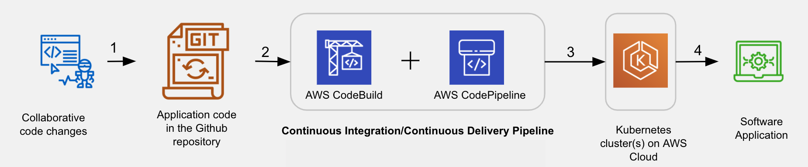

# Containerize and Deploy using Continuous Delivery

## Table of Contents   
1. [Overview](#overview)
2. [Project ToDos](#project-todos)
3. [Prerequisites and App Overview](#prerequisites-and-app-overview)
4. [Steps to run the App Locally](#steps-to-run-the-app-locally)
5. [Containerizing and Running Locally](#containerizing-and-running-locally)
6. [Run the app on AWS Cloud](#run-the-app-on-aws-cloud)
7. [Create an EKS Cluster and IAM Role](#create-an-eks-cluster-and-iam-role)
8. [Deployment to Kubernetes using CodePipeline and CodeBuild](#deployment-to-kubernetes-using-codepipeline-and-codebuild)
9. [Adding Tests to the Build](#adding-tests-to-the-build)

## Overview

The prime objective of this project is to create a CI/CD pipeline. You will associate the pipeline's one end to your Github repository, and connect the other end to the EKS cluster. You will create this CI/CD pipeline programmatically using the code (Cloudformation template file) that we will provide to you.

The subsequent pages of this lesson will guide you to create an and EKS cluster using a single command, AWS CodeBuild and CodePipeline programmatically using a CloudFormation template available to you.



The diagram above shows the various stages of the Pipeline. The actions marked as 1, 2, 3, and 4 signify the following:

1. **Code check-in** - The application code for the Flask app is hosted on Github. Multiple contributors can contribute to the repository collaboratively.
2. **Trigger Build** - As soon as a commit happens in the Github repository, it will trigger the CodeBuild. This step requires connecting your Github account to the AWS CodeBuild service using a GitHub access token. Codebuld will build a new image for your application, and push it to a container registry.
3. **Automatic Deployment** - The CodePipeline service will automatically deploy the application image to your Kubernetes cluster.
4. **Service** - Kubernetes cluster will start serving the application endpoints.


## Project ToDos
The current project lesson has two major parts, and each part has incremental steps to follow:

### Run the App locally
- First, you will get familiar with the Flask app by running it locally
- Next, you will containerize the same app locally so that you know the necessary environment for your (containerized) app to run. This step will make you familiar with writing a Dockerfile, building an image, and how to run a container.

### Run the App at scale on AWS Cloud
This part aims to create a CI/CD pipeline (using AWS Codebuild and CodePipeline). The steps you will follow are:

- *Create EKS Cluster and an IAM role*
You will start with creating an EKS cluster in your preferred region, using AWS CLI. Then, you will create an IAM role that the Codebuild will assume to access your k8s/EKS cluster. This IAM role will have the necessary access permissions, and you will also have to add this role to the k8s cluster's configMap. 

- *Create Github access token*
Next, you will generate an access-token from your Github account. You will share this token with the AWS Codebuild service (programmatically) so that it can build and test your code. 

- *Create Codebuild and CodePipeline resources using CloudFormation template*
Now, you will create the necessary AWS resources using a script, Cloudformation template (.yaml) file, available to you. These resources collectively are called stack. It will automatically create the Codebuild and Codepipeline instances for you. 

- *Build and deploy*
Finally, you will trigger the manual build (on Codebuild web console) to deploy and run the app on the K8s cluster. Besides, any GitHub check-ins will also trigger the pipeline.


## Prerequisites and App Overview

### Prerequisites
- [x] Docker Desktop - Installation instructions can be found [here](https://docs.docker.com/get-docker/).
- [x] Git: See the download instructions [here](https://git-scm.com/downloads)
- [x] Code editor: You can [download and install VS code](https://code.visualstudio.com/download) here.
- [x] AWS Account
- [x] Python version between 3.7 and 3.9. Check the current version using:

```bash
#  Mac/Linux/Windows 
python --version
```

You can download a specific release version from [here](https://www.python.org/downloads/).

- [x] Python package manager - PIP 19.x or higher. PIP is already installed in Python 3 >=3.4 downloaded from python.org . However, you can upgrade to a specific version, say 20.2.3, using the command:
```bash
#  Mac/Linux/Windows Check the current version
pip --version
# Mac/Linux
pip install --upgrade pip==20.2.3
# Windows
python -m pip install --upgrade pip==20.2.3
```

- [x] Terminal
    - Mac/Linux users can use the default terminal.
    - Windows users can use either the GitBash terminal or WSL.
- [x] Command line utilities:
    - AWS CLI: Installation instructions can be found here. AWS CLI should be configured using the aws configure command. Important: Do not use the us-east-1 because the EKS cluster creation may fails in us-east-1 mostly. Change the default region to:
```bash
    aws configure set region us-east-2
    # Run this command to see if the AWSCLI is configured correctly. It should return the list of IAM users. 
    aws iam list-users
```
    Ensure to create all your resources in a single region.

    - EKSCTL: Installation instructions can be found [here](https://docs.aws.amazon.com/eks/latest/userguide/eksctl.html#installing-eksctl) or [here](https://eksctl.io/introduction/#installation) to download and install eksctl utility.
    - KUBECTL: Installation instructions can be found [here](https://kubernetes.io/docs/tasks/tools/).

### Initial setup
Fork the [Server and Deployment Containerization Github repo](https://github.com/nguyentrongphuc/cd0157-Server-Deployment-and-Containerization) to your Github account. Locally clone your forked version to begin working on the project.

```bash
git clone https://github.com/[username]/cd0157-Server-Deployment-and-Containerization.git
cd cd0157-Server-Deployment-and-Containerization/
```

These are the files relevant for the current project:
```bash
.
├── Dockerfile
├── aws-auth-patch.yml           # TODO - A sample EKS Cluster configMap file. 
├── ci-cd-codepipeline.cfn.yml   # TODO - YAML template to create CodePipeline pipeline and CodeBuild resources
├── buildspec.yml
├── simple_jwt_api.yml
├── trust.json              # TODO - Used for creating an IAM role for Codebuild
├── iam-role-policy.json    
├── main.py				 
├── requirements.txt		
└── test_main.py            # TODO - Unit Test file
```

Most of the files needed in this project are already available to you. You will have to make changes in the following files aligned with the upcoming instructions:

1. *trust.json*: This file and iam-role-policy.json file will be used for creating an IAM role for Codebuild to assume while building your code and deploying to the EKS cluster.

2. *aws-auth-patch.yml*: You will create a file similar to this one after creating en EKS cluster. We have given you a sample file so that the YAML indentations will not trouble you.

3. *ci-cd-codepipeline.cfn.yml*: This is the Cloudformation template that we will use to create Codebuild, Codepipeline, and related resources like IAM roles and S3 bucket. This file is almost complete, except for you to write a few parameter values specific to you. Once the Codebuild resource is created, it will run the commands mentioned in the buildspec.yml.

3. *test_main.py*: You will write unit tests in this file.

### Overview - The Endpoints of the Flask App
The Flask app that will be used for this project consists of a simple API with three endpoints:

1. GET '/': This is a simple health check, which returns the response 'Healthy'.

2. POST '/auth': This takes an email and password as json arguments and returns a JWT based on a custom secret.

3. GET '/contents': This requires a valid JWT, and returns the decrypted contents of that token.

The app relies on a secret set as the environment variable `JWT_SECRET` to produce a JWT. The built-in Flask server is adequate for local development, but not production, so you will be using the production-ready [Gunicorn](https://gunicorn.org) server when deploying the app.


## Steps to run the App Locally
The following steps describe how to run the Flask API locally with the standard Flask server, so that you can test endpoints before you containerize the app:

### 1. Install python dependencies
These dependencies are kept in a requirements.txt file in the root directory of the repository. To install them, go to the project directory that you’ve just downloaded, and run the command:
```bash
# Assuming you are in the cd0157-Server-Deployment-and-Containerization/ directory
pip install -r requirements.txt
```
### 2. Set up the environment
You will need the following two variables available in your terminal environment:
- JWT_SECRET - The text string to be used for creating the JWT.
- LOG_LEVEL - It represents the level of logging. It is optional to be set. It has a default value as 'INFO', but when debugging an app locally, you may want to set it to 'DEBUG'.

To add these to your terminal environment, run the following: 
```bash 
# A secret text string to be used to creating a JWT 
export JWT_SECRET='myjwtsecret' export LOG_LEVEL=DEBUG 
# Verify 
echo $JWT_SECRET 
echo $LOG_LEVEL
```

### 3. Run the app
Run the app using the Flask server, from the root directory of the downloaded repository, run:

`python main.py`

Open http://127.0.0.1:8080/ in a new browser OR run 
`curl --request GET http://localhost:8080/` on the command-line terminal. It will give you a response as "Healthy".

### 4. Install a command-line JSON processor
Before trying to access other endpoints of the app, we need the jq, a package that helps to pretty-print JSON outputs. In simple words, the JQ package helps you parse, filter, or modify JSON outputs. Open a new terminal window, and run the command below.

```bash
# For Linux
sudo apt-get install jq  
# For Mac
brew install jq 
# For Windows, 
chocolatey install jq
```

For detailed information, refer to a simple tutorial [here](https://jqlang.github.io/jq/tutorial/), though it's not required for the final submission.

### 5. Access endpoint /auth 
To try the `/auth` endpoint, use the following command, replacing email/password as applicable to you:
```bash
export TOKEN=`curl --data '{"email":"abc@xyz.com","password":"mypwd"}' --header "Content-Type: application/json" -X POST localhost:8080/auth  | jq -r '.token'`
```

This calls the endpoint 'localhost:8080/auth' with the email/password as the message body. The return value is a JWT token based on the secret string you supplied. We are assigning that secret to the environment variable 'TOKEN'. To see the JWT token, run:

```bash
echo $TOKEN
```

### 6. Troubleshoot
If you are facing any of the following errors, then it is related to the pyjwt package version issue.

- parse error: Invalid numeric literal at line 1, column 10
- AttributeError: 'str' object has no attribute 'decode',

We have installed the `pyjwt==1.7.1` package using the requirements.txt file. If you have a higher version, then the commands above may not work. PyJWT 2.0.0 or a higher version does not have a `decode()` method, causing the error mentioned above. You can uninstall the current version, and install the desired version as:

```bash
pip uninstall pyjwt
pip install pyjwt==1.7.1
```

### 7. Access endpoint /contents

To try the `/contents` endpoint which decrypts the token and returns its content, run:

`curl --request GET 'http://localhost:8080/contents' -H "Authorization: Bearer ${TOKEN}" | jq .`

You should see the email id that you passed in as one of the values.

## Containerizing and Running Locally

The following steps describe how to complete the Dockerization part of the project. After you complete these steps, you should have the Flask application up and running in a Docker container.

### 1. Verify the Dockerfile
Verify the Dockerfile to have the following content the in the app's home directory:
```bash
# Use the `python:3.7` as a source image from the Amazon ECR Public Gallery
# We are not using `python:3.7.2-slim` from Dockerhub because it has put a  pull rate limit. 
FROM public.ecr.aws/sam/build-python3.7:latest
# Set up an app directory for your code
COPY . /app
WORKDIR /app
# Install `pip` and needed Python packages from `requirements.txt`
RUN pip install --upgrade pip
RUN pip install -r requirements.txt
# Define an entrypoint which will run the main app using the Gunicorn WSGI server.
ENTRYPOINT ["gunicorn", "-b", ":8080", "main:APP"]
```

### 2. Store Environment Variables

Containers cannot read the values stored in your localhost's environment variables. Therefore, create a file named `.env_file` and save both `JWT_SECRET` and `LOG_LEVEL` into that `.env_file`. We will use this file while creating the container. Here, we do not need the export command, just an equals sign:
```bash
JWT_SECRET='myjwtsecret'
LOG_LEVEL=DEBUG
```
This `.env_file` is only for the purposes of running the container locally, you do not want to push it into the Github or other public repositories. You can prevent this by adding it to your `.gitignore` file, which will cause git to ignore it. To safely store and use secrets in the cloud, use a secure solution such as AWS’s parameter store.

### 3. Start the Docker Desktop service.
### 4. Build an image
Build a local Docker image, by running the commands below from the directory where your Dockerfile resides:
```bash
docker build -t myimage .

# Other useful commands
# Check the list of images
docker image ls
# Remove any image
docker image rm <image_id>
```

### 5. Create and run a container

Create and run a container using the image locally:

- You can pass the name of the env file using the flag `--env-file=<YOUR_ENV_FILENAME>`
- You should expose the port 8080 of the container to port 80 on your host machine.
```bash
docker run --name myContainer --env-file=.env_file -p 80:8080 myimage
# Other useful commands
# List running containers
docker container ls
docker ps
# Stop a container
docker container stop <container_id>
# Remove a container
docker container rm <container_id>
```
### 6. Check the endpoints
To use the endpoints, you can use the same curl commands as before, except using port 80 this time. Open a new terminal window, and try the following command:
```bash
# Flask server running inside a container
curl --request GET 'http://localhost:80/'
# Flask server running locally (only the port number is different)
curl --request GET 'http://localhost:8080/'
```

or check http://localhost:80/ in the browser. You should see a "Healthy" response. For other two endpoints, try running the following commands:

```bash
# Calls the endpoint 'localhost:80/auth' with the email/password as the message body. 
# The return JWT token assigned to the environment variable 'TOKEN' 
export TOKEN=`curl --data '{"email":"abc@xyz.com","password":"WindowsPwd"}' --header "Content-Type: application/json" -X POST localhost:80/auth  | jq -r '.token'`
echo $TOKEN
# Decrypt the token and returns its content
curl --request GET 'http://localhost:80/contents' -H "Authorization: Bearer ${TOKEN}" | jq .
```

## Run the app on AWS Cloud

https://www.youtube.com/watch?v=JzgZfOJ8Fjo

The next section of the project aims to create a CI/CD pipeline. The steps you will follow are:

### 1. Create an EKS Cluster, IAM Role for CodeBuild, and Authorize the CodeBuild
- Create an EKS Cluster - Start with creating an EKS cluster in your preferred region, using eksctl command.
- IAM Role for CodeBuild - Create an IAM role that the Codebuild will assume to access your k8s/EKS cluster. This IAM role will have the necessary access permissions (attached JSON policies),
- Authorize the CodeBuild using EKS RBAC - Add IAM Role to the Kubernetes cluster's configMap. 

### 2. Deployment to Kubernetes using CodePipeline and CodeBuild
- **Generate a Github access token**
Cenerate an access-token from your Github account. We will share this token with the Codebuild service so that it can listen to the the repository commits.

- **Create Codebuild and CodePipeline resources using CloudFormation template**
Create a pipeline watching for commits to your Github repository using Cloudformation template (.yaml) file. 

- **Set a Secret using AWS Parameter Store**
In order to pass your JWT secret to the app in Kubernetes securely, you will set the JWT secret using AWS parameter store.

- **Build and deploy**
Finally, you will trigger the build based on a Github commit.

## Create an EKS Cluster and IAM Role
### Prerequisite
You must have the following:

- AWS CLI installed and configured using the aws configure command.
- The EKSCTL and KUBECTL command-line utilities installed in your system. Check and note down the KUBECTL version, using:

`kubectl version`

**Note** - You must use a kubectl version within one minor version difference of your Amazon EKS cluster control plane. For example, a 1.21 kubectl client works with Kubernetes 1.20, 1.21, and 1.22 clusters.

You current working directory must be: `cd cd0157-Server-Deployment-and-Containerization`

### 1. Create an EKS (Kubernetes) Cluster
#### 1.1 Create - Create an EKS cluster named “simple-jwt-api” in a region of your choice:

```bash
eksctl create cluster --name simple-jwt-api --nodes=2 --version=1.22 --instance-types=t2.medium --region=us-east-2
# Known Issue - If your default region is us-east-1, then the cluster creation may fail.
```

The command above will take a few minutes to execute, and create the following resources:

- EKS cluster
- A nodegroup containing two nodes.

You can view the cluster in the EKS cluster dashboard. If you don’t see any progress, be sure that you are viewing clusters in the same region that they are being created.

Use a consistent `kubectl` version in your EKS Cluster, local machine, and later in the Codebuild's buildspec.yml file.

#### 1.2 Verify - After creating the cluster, check the health of your clusters nodes:
`kubectl get nodes`

#### 1.3 Delete when the project is over 
Remember, in case you wish to delete the cluster, you can do it using eksctl:
```bash
eksctl delete cluster simple-jwt-api  --region=us-east-2
```

### 2. Create an IAM Role for CodeBuild
You will need an **IAM role that the CodeBuild will assume to access your EKS cluster**. In the previous lesson, you have already created such an IAM role with a custom trust-relationship and a policy. In case you have deleted that role, you can follow the steps below to quickly set up an IAM role. Otherwise, you can ignore the current step.

#### 2.1 Get your AWS account id::
```bash
aws sts get-caller-identity --query Account --output text
# Returns the AWS account id similar to 
# 519002666132
```

#### 2.2 Update the [trust.json](https://github.com/nguyentrongphuc/cd0157-Server-Deployment-and-Containerization/blob/master/trust.json) file with your AWS account id.
```json
{
"Version": "2012-10-17",
"Statement": [
    {
        "Effect": "Allow",
        "Principal": {
            "AWS": "arn:aws:iam::<ACCOUNT_ID>:root"
        },
        "Action": "sts:AssumeRole"
    }
]
}
```

***Replace the <ACCOUNT_ID> with your actual AWS account ID.***

#### 2.3 Create a role, 'UdacityFlaskDeployCBKubectlRole', using the trust.json trust relationship:
```bash
aws iam create-role --role-name UdacityFlaskDeployCBKubectlRole --assume-role-policy-document file://trust.json --output text --query 'Role.Arn'
# Returns something similar to 
# arn:aws:iam::519002666132:role/UdacityFlaskDeployCBKubectlRole
```

#### 2.4 Policy is also a JSON file where we will define the set of permissible actions that the Codebuild can perform.
We have given you a policy file, [iam-role-policy.json](https://github.com/nguyentrongphuc/cd0157-Server-Deployment-and-Containerization/blob/master/iam-role-policy.json), containing the following permissible actions: "eks:Describe*" and "ssm:GetParameters".

```json
{
 "Version": "2012-10-17",
 "Statement": [
     {
         "Effect": "Allow",
         "Action": [
             "eks:Describe*",
           	 "ssm:GetParameters"
         ],
         "Resource": "*"
     }
 ]
}
```
#### 2.5 Attach the iam-role-policy.json policy to the 'UdacityFlaskDeployCBKubectlRole' as:
```bash
aws iam put-role-policy --role-name UdacityFlaskDeployCBKubectlRole --policy-name eks-describe --policy-document file://iam-role-policy.json
```

### 3. Authorize the CodeBuild using EKS RBAC
`You will have to repeat this step every time you create a new EKS cluster.`

For the CodeBuild too administer the cluster, you will have to add an entry of this new role into the 'aws-auth ConfigMap'. The [aws-auth ConfigMap](https://github.com/nguyentrongphuc/cd0157-Server-Deployment-and-Containerization/blob/master/aws-auth-patch.yml) is used to grant role-based access control to your cluster.

#### 3.1 Fetch - Get the current configmap and save it to a file:
```bash
# Mac/Linux - The file will be created at `<current_directory>/tmp/aws-auth-patch.yml` path
kubectl get -n kube-system configmap/aws-auth -o yaml > ./tmp/aws-auth-patch.yml
# Windows - The file will be created in the current working directory
kubectl get -n kube-system configmap/aws-auth -o yaml > aws-auth-patch.yml
```

#### 3.2 Edit - Open the aws-auth-patch.yml file using any editor, such as VS code editor:
```bash
# Mac/Linux
code /System/Volumes/Data/private/tmp/aws-auth-patch.yml
# Windows
code aws-auth-patch.yml
```

Add the following group in the ***data → mapRoles*** section of this file. YAML is indentation-sensitive, therefore refer to the snapshot below for a correct indentation:

```yml
    - groups:
        - system:masters
        rolearn: arn:aws:iam::<ACCOUNT_ID>:role/UdacityFlaskDeployCBKubectlRole
        username: build  
```

Don't forget to replace the <ACCOUNT_ID> with your AWS account Id. Do not copy-paste the code snippet from above. Instead, look at this sample `aws-auth-patch.yml` file and the snapshot below to stay careful with the indentations.

#### 3.3 Update - Update your cluster's configmap:
```bash
# Mac/Linux
kubectl patch configmap/aws-auth -n kube-system --patch "$(cat /tmp/aws-auth-patch.yml)"
# Windows
kubectl patch configmap/aws-auth -n kube-system --patch "$(cat aws-auth-patch.yml)"
```

The command above must show you `configmap/aws-auth` patched as a response.

#### 3.4 Troubleshoot - In case of the following error, re-run the above three steps beginning from the kubectl get command.

`Error from server (Conflict): Operation cannot be fulfilled on configmaps "aws-auth": the object has been modified; please apply your changes to the latest version and try again`

#### 3.5 Check the health of your clusters nodes:

`kubectl get nodes`


#### Checklist
- [x] I have created an EKS cluster named `simple-jwt-api` using `eksctl`
- [x] I have followed instructions to create an IAM role for CodeBuild to interact with EKS.
- [x] I have updated the ConfigMap

## Deployment to Kubernetes using CodePipeline and CodeBuild

You will now create a pipeline that watches your Github and deploys your application using CodePipeline and CodeBuild. When changes are pushed to the repo, it will build a new image and deploy it to your EKS cluster. Follow the steps below to complete your project.

### 1. Generate a Github access token
A Github access token will allow Codebuild to monitor when a repo is changed. A token is analogous to your Github password and can be generated here. You should generate the token with full control of private repositories, as shown in the image below. Be sure to save the token somewhere that is secure.


Generate GitHub Access Token with full control of private repositories

Once you create a personal access token, you can share this with any service (such as AWS CloudFormation) to allow accessing the repositories under your Github account.

### 2. Create Codebuild and CodePipeline resources using CloudFormation template
https://www.youtube.com/watch?v=NYqmLUaCUyk

#### 2.1. Modify the template
There is a file named ci-cd-codepipeline.cfn.yml provided in your starter repo. This is the template file that you will use to create your CodePipeline pipeline and CodeBuild project Open this file, and go to the 'Parameters' section. These are parameters that will accept values when you create a stack. Ensure that the following values are used for the parameter variables:


|Parameter|Possible Value| Description |
|---|---|---|
|EksClusterName|simple-jwt-api| Name of the EKS cluster you created | 
|GitSourceRepo|cd0157-Server-Deployment-and-Containerization| Github repo name| 
|GitBranch|master| Or any other you want to link to the Pipeline| 
|GitHubUser|nguyentrongphuc| Your Github username| 
|KubectlRoleName|UdacityFlaskDeployCBKubectlRole| We created this role earlier|

**Did you notice that we haven't saved the GitHubToken in this file?** Do not use any quotes in your values, as shown in the snapshot below. Save the changes you've made.


Update your Github username in the template file

#### 2.2. Review the resources
Review the resources that will be created using this `ci-cd-codepipeline.cfn.yml` file. The Cloudformation template file `ci-cd-codepipeline.cfn.yml` will create the following resources:

- ECR repository to store your Docker image.
- S3 bucket to store your Pipeline artifacts
- A few IAM roles that individual services will assume
- A Lambda function
- CodeBuild and CodePipeline resources

#### 2.3. Create Stack
Use the AWS web-console to create a stack for CodePipeline using the CloudFormation template file `ci-cd-codepipeline.cfn.yml`. Go to the CloudFormation service in the AWS console. Press the `Create Stack` button. It will make you go through the following three steps -

- Specify template - Choose the options "Template is ready" and "Upload a template file" to upload the template file ci-cd-codepipeline.cfn.yml. Click the 'Next' button. 

- Specify stack details - Give the stack a name. You will have a few fileds auto-populated from the parameters used in the ci-cd-codepipeline.cfn.yml file. Fill in your GitHub access token generated in the previous step. Ensure that the Github repo name, IAM role, and EKS cluster name matches with the ones you created earlier.


- Configure stack options - Leave default, and create the stack. You can check the stack status in the CloudFormation console. It will take some time (5-15 mins) to create the stack. After the successful creation of the stack, you can see the CodeBuild and CodePipeline resources get created for you. In addition, the Cloudformation template will create a few more resources, such as an S3 bucket, a Lambda function, and others. 

- Troubleshoot
If there is an indentation error in your YAML template file, the CloudFormation will raise a "Template format error". In such a case, you will have to identify the line of error in the template, using any external tools, such as - [YAML Validator](https://codebeautify.org/yaml-validator) or [YAML Lint](https://www.yamllint.com).


### 3. Save a Secret in AWS Parameter Store
You app running in the EKS cluster will need a secret text string for creating the JWT (Remember the `/auth` endpoint?). We need a way to pass your text secret to the app in kubernetes securly. You will be using AWS Parameter Store to do this.

Run this command from the project home directory to put secret into AWS Parameter Store

```bash
aws ssm put-parameter --name JWT_SECRET --overwrite --value "myjwtsecret" --type SecureString
## Verify
aws ssm get-parameter --name JWT_SECRET
```

Once you submit your project and receive the reviews, you can consider deleting the variable from parameter-store using:
```bash
aws ssm delete-parameter --name JWT_SECRET
```

### 4. How does CodeBuild know the build steps?
In the previous step, the CloudFormation template file, ci-cd-codepipeline.cfn.yml, will automatically create a CodeBuild resource. When the build will trigger, Codebuild will execute the commands/steps mentioned in the buildspec.yml file.

As per AWS documentation, a buildspec is a collection of build commands and related settings, in YAML format, that CodeBuild uses to run a build.

The CodeBuild expects the build specification in the buildspec.yml. This file must be placed in the root of your source directory (Github repo).

https://youtu.be/Ti3BgUTwUoA

#### 4.1. Configuring buildspec.yml
In the buildspec.yml file, use the same (or within one minor version difference) KUBECTL version as you've used while creating an EKS cluster. You can run `kubectl version --short --client` in your local terminal to check the version locally. To change the version in the buildspec.yml file, change [this line](https://github.com/nguyentrongphuc/cd0157-Server-Deployment-and-Containerization/blob/master/buildspec.yml#L20) in the `buildspec.yml` with a specific version of your choice. Refer to the [AWS docs](https://docs.aws.amazon.com/eks/latest/userguide/install-kubectl.html) or [k8s docs](https://kubernetes.io/docs/tasks/tools/install-kubectl-linux/) to see the available versions for Linux machines (our Codebuild will use Linux containers internally to run build commands!).

**Note** - You must use a kubectl version within one minor version difference of your Amazon EKS cluster control plane. For example, a 1.21 kubectl client works with Kubernetes 1.20, 1.21, and 1.22 clusters.

Also, ensure that the following code is present at the end of the `buildspec.yml` file:

```yml
env:
  parameter-store:         
    JWT_SECRET: JWT_SECRET
```

This lets CodeBuild know to set an environment variable based on a value in the parameter-store.

#### 4.2. Details of the buildspec.yml
The buildspec.yml file specifies the different phases of a build, such as an install, pre-build, build, and post-build. Each phase has a set of commands to be automatically executed by CodeBuild.

- `install` phase: Install Python, pip, kubectl, and update the system path
- `pre-build` phase: Log into the ECR repo where the Codebuils will push the Docker image.
- `build` phase: Build a Docker image
- `post-build` phase: Push the Docker image to the ECR repo, update the EKS cluster's kubeconfig, and apply the configuration defined in the simple_jwt_api.yml to the cluster.

You can see each command being executed in the CodeBuild log console when you trigger a build.

### 5. Troubleshoot - How to debug a failed build?

https://youtu.be/R4j4oMiWwK8

When a build fails, you can look at the logs to see the errors. Here is a popular error:

**Error**: You must be logged in to the server (the server has asked for the client to provide credentials)

The error above infers that the Codebuild could not log into the cluster, possibly because Codebuild does not have sufficient permissions to perform the logging action. In this case, you should check and re-update the cluster's ConfigMap as:

```bash
## Download a fresh copy of the configmap
## You can choose a different path or current working directory to save the  auth-patch.yml
kubectl get -n kube-system configmap/aws-auth -o yaml > /tmp/aws-auth-patch.yml
## Open the configmap in an editor, and update the **data --> mapRoles** section as described earlier while creating the cluster
## Update the configmap
kubectl patch configmap/aws-auth -n kube-system --patch "$(cat /tmp/aws-auth-patch.yml)"
```

Another prevalent error is:

Build failed to start. The following error occurred: ArtifactsOverride must be set when using artifacts type CodePipelines

The error above could be due to the incorrect parameters used in the ci-cd-codepipeline.cfn.yml file. To verify the existing parameters, look at the CloudFormation console → your Stack → Stack parameters.
Review your CloudFormation console &#8594;  your Stack &#8594;  Stack parameters
Review your CloudFormation console → your Stack → Stack parameters

### 6. The Working Project
https://youtu.be/87EGNJSKYgA

You will not be able to trigger a manual build because the Codebuild is set to use the CodePipeline artifact. Triggering it manually may lead to this error:

Build failed to start. The following error occurred: ArtifactsOverride must be set when using artifacts type CodePipelines

A workaround for a manual build is: Go to the CodePipeline console → your Pipeline → click on the Release change button. However, we recommend the automatic builds. Try the steps below to test the automatic builds:

#### Push a commit - To check if the pipeline works, Make a git push to your repository to trigger an automatic build as:
```bash
## Verify the remote destination. 
## It should point to the repo in your account (not the repo in the Udacity account). 
## Otherwise, FORK the Udacity repo, and then clone it locally
git remote -v
## Make the changes locally
git status
## Add the changed file to the Git staging area
git add <filename>
## Provide a meaningful commit description
git commit -m “my comment“
## Push to the local master branch to the remote master branch
git push
```

#### Verify - In the AWS console go to the CodePipeline dashboard. You should see that the build is running, and it should succeed.

https://youtu.be/6HD_0Z3t_d0

#### Test your Endpoint - To test your API endpoints, get the external IP for your service:

```bash
kubectl get services simple-jwt-api -o wide
```

Now use the external IP url to test the app:
```bash
export TOKEN=`curl -d '{"email":"<EMAIL>","password":"<PASSWORD>"}' -H "Content-Type: application/json" -X POST <EXTERNAL-IP URL>/auth  | jq -r '.token'`
curl --request GET '<EXTERNAL-IP URL>/contents' -H "Authorization: Bearer ${TOKEN}" | jq 
```

#### Save the external IP from above to provide to the reviewer when you will submit your project.


## Adding Tests to the Build

The final part of this project involves adding tests to your deployment. You can follow the steps below to accomplish this.

### Add running tests as part of the build. To require the unit tests to pass before our build will deploy new code to your cluster, you will add the tests to the build stage. Remember you installed the requirements and ran the unit tests locally at the beginning of this project. You will add the same commands to the buildspec.yml:

- Open buildspec.yml
- In the prebuild section, add a line to install the requirements and a line to run the tests. You may need to refer to 'pip' as 'pip3' and 'python' as 'python3', as:
```yml
pre_build:
  commands:
    - pip3 install -r requirements.txt 
    - python -m pytest test_main.py
```
- Save the file
### You can check the tests prevent a bad deployment by breaking the tests on purpose:
- Open the test_main.py file
- Add assert False to any of the tests
- Commit your code and push it to Github
- Check that the build fails in CodePipeline