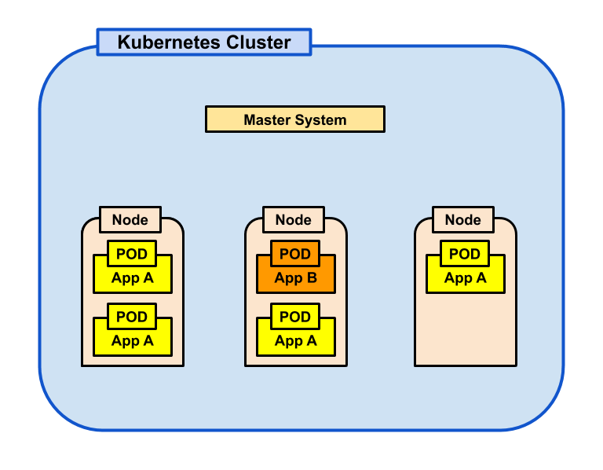
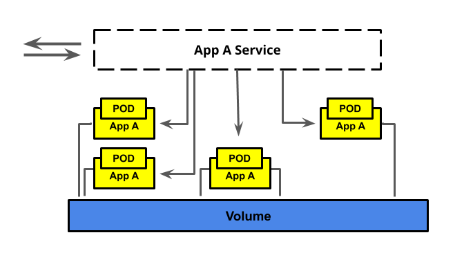
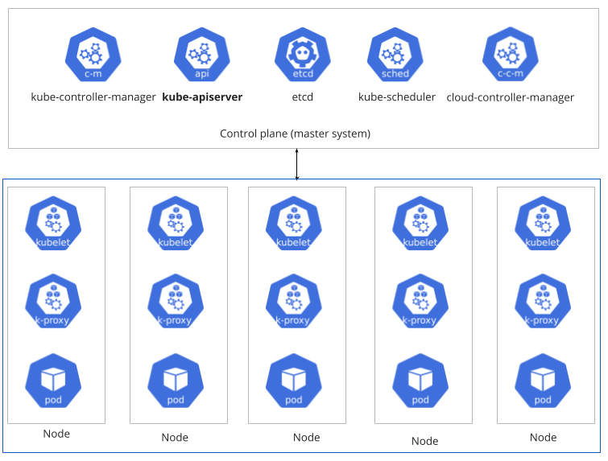
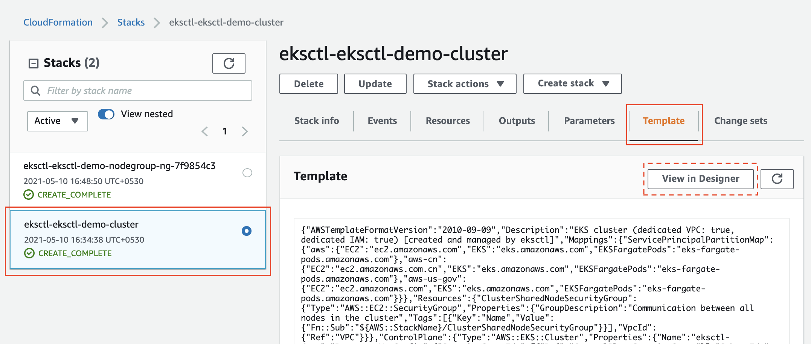
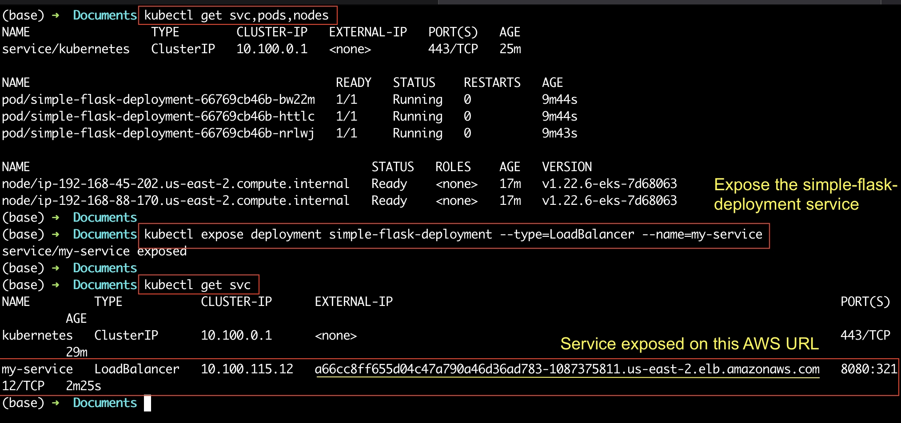

# AWS
## AWS CLI
### Step 1. Install AWS CLI v2
Refer to the official [AWS instructions to install/update AWS CLI](https://docs.aws.amazon.com/cli/latest/userguide/getting-started-install.html) (version 2) based on your underlying OS. You can verify the installation using the following command in your terminal (macOS)/cmd (Windows).
```python
# Display the folder that contains the symlink to the aws cli tool
which aws
# See the current version
aws --version
```

### Step 2. Create an IAM user

### Step 3. Configure the AWS CLI
You will need to configure the following four items on your local machine before you can interact with any of the AWS services:

- Access key - It is a combination of an Access Key ID and a Secret Access Key. Together, they are referred to as Access key. You can generate an Access key from the AWS IAM service, and specify the level of permissions (authorization) with the help of IAM Roles.
- Default AWS Region - It specifies the AWS Region where you want to send your requests by default.
- Default output format - It specifies how the results are formatted. It can either be a json, yaml, text, or a table.
- Profile - A collection of settings is called a profile. The default profile name is default, however, you can create a new profile using the `aws configure --profile new_name` command.

Here are the steps to configure the AWS CLI in your terminal:

- Run the command below to configure the AWS CLI using the Access Key ID and a Secret Access Key generated in the previous step. If you have closed the web console that showed the access key, you can open the downloaded access key file (.csv) to copy the keys later.
`aws configure`

- The commands above will store the access key in a default file `~/.aws/credentials` and store the profile in the `~/.aws/config` file. Upon prompt, paste the copied access key (access key id and secret access key). Enter the default region as `us-east-2` and output format as `json`. You can verify the saved config using:
```python
# View the current configuration
aws configure list 
# View all existing profile names
aws configure list-profiles
# In case, you want to change the region in a given profile
# aws configure set <parameter> <value>  --profile <profile-name>
aws configure set region us-east-2  
```
- Let the system know that your sensitive information is residing in the .aws folder
```terminal
export AWS_CONFIG_FILE=~/.aws/config
export AWS_SHARED_CREDENTIALS_FILE=~/.aws/credentials
```

### Step 4. Run your first AWS CLI command
Check the successful configuration of the AWS CLI, by running either of the following AWS command:
```python
# If you've just one profile set locally
aws iam list-users
# If you've multiple profiles set locally
aws iam list-users --profile <profile-name>
```

The output will display the details of the recently created user:
```json
{
"Users": [
    {
        "Path": "/",
        "UserName": "Admin",
        "UserId": "AIDAZMXYZ3LY2BNC5ZM5E",
        "Arn": "arn:aws:iam::388752792305:user/Admin",
        "CreateDate": "2021-01-28T13:44:15+00:00"
    }
]
}
```

### Updating the specific variable in the configuration
In the future, you can set a single value, by using the command, such as:
```python
# Syntax
# aws configure set <varname> <value> [--profile profile-name]
aws configure set default.region us-east-2
```


## Create a Bucket using the CLI
```python
# Bucket names are unique across the Internet, just like DNS. 
# Replace the `033212455158` part with some other set of digits. 
aws s3api  create-bucket --bucket mybucket033212455158 --acl bucket-owner-full-control --region us-east-2 --create-bucket-configuration LocationConstraint=us-east-2
```
In the command above,

- `--bucket` option specifies the bucket name of your choice. It must be unique across all AWS accounts.
- `--acl` option specifies the accessibility level
- `--region` specifies the AWS region where you want to create this bucket.
- `--create-bucket-configuration`: If you want to create the bucket in the desired region outside of us-east-1, you will need something like `--region us-east-2 --create-bucket-configuration LocationConstraint=us-east-2` which will set an appropriate LocationConstraint

reference: https://docs.aws.amazon.com/cli/latest/reference/s3api/create-bucket.html

## Upload a sample file to your bucket. 

The command below uploads a file names sample.html, however, you can choose any file from your local system.
`aws s3api put-object --bucket mybucket033212455158 --key sample.html --body sample.html --content-type text/html`
In the command above,

- `--key` option specifies the name you want to assign to your object in the bucket
- `--body` option specifies the file name (complete path) to upload from your local system
- `--content-type` specifies the standard MIME type describing the format of the contents.

reference: https://docs.aws.amazon.com/cli/latest/reference/s3api/put-object.html

## Verify the S3 bucket by going to the AWS web console. 
Alternatively, you can run `aws s3 ls` in the command line.


## Delete the bucket and its content. 
A bucket can only be deleted if it is empty. Therefore, first delete the Sample.html, and then delete the bucket, as follows:
```python
aws s3api delete-object --bucket mybucket033212455158 --key sample.html
aws s3api delete-bucket --bucket mybucket033212455158
```
reference: https://docs.aws.amazon.com/cli/latest/reference/s3api/index.html#available-commands

# Kubernetes

## What is Kubernetes?
[Kubernetes](https://kubernetes.io) is one of the most popular orchestration system for containers developed by Google and open sourced in 2014. It can automate many of the manual operations of deployment and scaling of a containerized application. A few of the benefits of using Kubernetes (k8s) are:

- The ease of scaling the container instances up or down to meet varying demands (horizontal scaling).
- It can balance loads, and perform health checks.
- It helps in setting-up inter-container communication (networking).
Kubernetes was born out of the lessons learned in the [Scaling containerized apps at Google](https://queue.acm.org/detail.cfm?id=2898444).

## Benefits of using Kubernetes
A few more benefits of using Kubernetes are:

- High availability architecture
- Auto-scaling
- Rich Ecosystem
- Service discovery
- Container health management
- Secrets and configuration management The downside of these features is the high complexity and learning curve of Kubernetes.

## Kubernetes Cluster Architecture
The core of Kubernetes is the cluster. A cluster comprises several node machines for running containerized applications and a master for managing the nodes. Each node is capable of running multiple pods (a group of containers). Therefore, each node has a container runtime, such as Docker, installed on it.

The diagram below shows a simplistic view of a Kubernetes cluster.



- Cluster: A group of machines running Kubernetes
- Master: The system which controls a Kubernetes cluster. You will typically interact with the master when you communicate with a cluster. The master includes an api, scheduler, and management daemon.
- Nodes: The machines in a cluster. These can be virtual, physical, or a combination of both.
- Pods: It is considered as the smallest unit in a cluster. It is a logical group of containers on a node that runs a particular module/application. A pod consists of one or more containers, shared storage resources, and a unique IP address. Note that all the containers within a Pod share the namespaces and filesystem volumes. Pods are not persistent, and may be brought up and down by the master during scaling.

### Reliability
In the cluster diagram shown above, each POD runs a specific module (App A, App B, App C...) of an application. Moreover, the PODs are not attached to a specific node (host). Instead, multiple nodes are hosting similar PODs. This architecture mitigates the chances of a single point of failure, and thus provides high availability. The master system brings a layer of abstraction for the external client/application.

### Service and Volumes
All pods that are running the same application module share storage resources. Further, all the containers within a pod share the namespaces and filesystem volumes. Hence, in order to have a persistent way to store data, volumes can be attached to pods.

Whereas, in order to have a persistent way to communicate with ephemeral pods, a higher-level service abstraction is provided, called Kubernetes Service.

Service: An abstraction of a set of pods and interface for how to interact with the pods




## How do you set up a Kubernetes cluster?
There are two main methods:

- Set up a local cluster (preferably with Docker Desktop) - If you are using Docker and have [enabled Kubernetes](https://docs.docker.com/desktop/get-started/#kubernetes) then you already have a standalone Kubernetes server running. Creating local clusters is beyond the scope of this course. However, we have dropped the link to a great tutorial at the bottom of this page.
- Provision a cloud cluster. Most cloud service providers offer a managed Kubernetes service:
Amazon through Amazon EKS
    + Google through Google Kubernetes Engine GKE
    + Microsoft through Azure Kubernetes Service (AKS). In this course, you will learn to use Amazon EKS.

External Resourcces

- Must Read Moving forward, we will be using Amazon EKS to create and manage a cluster for us. Before that, we encourage you to get an insight about the Kubernetes, its components, and Kubernetes API from the [official documentation](https://kubernetes.io/docs/concepts/overview/). This will help you gain a good understanding of cluster architecture and its working.
- [Optional] Want to learn how to create a cluster locally?

## Kubernetes Components
You can consider a cluster as a collection of

- Worker nodes (virtual-machines): These nodes run the containerized applications. A cluster must have at least one worker node. Each worker node hosts the pod(s), where, a pod is a logical group of running containers.
- A master-system: This system manages the overall cluster. It manages load balancing, backup, replication, scheduling, and much more.
The master-system is actually a control plane comprising a few components.



### What is a control plane?
The control plane manages the worker nodes and the Pods in the cluster. For example, it decides when to start up a new pod, or scheduling other events. It comprises the following components:

- kube-apiserver - This is the core component. It is an API server that exposes the Kubernetes API. In simple words, the kube-apiserver is the frontend for the control plane. It has two main purposes:
    + It exposes an HTTP API that allows end-users, different parts of your cluster, and external components to communicate.
    + It allows querying and manipulating the state of API objects (Pods, Namespaces, ConfigMaps, and Events).
- etcd - It is a key-value store of the cluster data.
- kube-scheduler - It monitors pods. It assigns a worker-node to the newly created pods.
- kube-controller-manager - It is an abstract layer that runs controller processes.
- cloud-controller-manager - It embeds cloud-specific control logic and lets you link your cluster into your cloud provider's API

### What's there in a worker node?
A worker node comprises of the following:

- kubelet - There should be an agent on each node that tracks that containers are running in the correct Pod. That agent is a kubelet.
- kube-proxy - It maintains network rules on nodes. These network rules allow network communication to your Pods from network sessions inside or outside of your cluster.
- Container runtime - Of course, each worker-node needs a container runtime, such as Docker, contained, CRI-O, or any other to run the containers.


# eksctl
eksctl is a simple CLI utility for creating clusters on Amazon EKS. It is only a utility that uses the services of AWS CloudFormation internally.

EKSCTL greatly simplifies EKS cluster creation, by auto-generating the necessary AWS resources in your default region, such as:

- VPC - a virtual network defined by a range of IP addresses allocated to you.
- Subnets - a subnet is a subset of the VPC (IP addresses) in your desired availability zone (data center)
- Nodegroups - logical group of worker nodes. Note that each node is a Virtual Machine (VM)
- Deciding the AMI and Type of the worker nodes. AMI defines the underlying OS, the default is Linux with supporting packages. Type defines the hardware capacity.
- Kubernetes API endpoint

## eksctl Installation
Follow the instructions available [here](https://docs.aws.amazon.com/eks/latest/userguide/eksctl.html#installing-eksctl) or [here](https://eksctl.io/introduction/#installation) to download and install eksctl utility. We've given you a summary below:

Latest Linux:
```terminal
curl --silent --location "https://github.com/weaveworks/eksctl/releases/download/latest_release/eksctl_$(uname -s)_amd64.tar.gz" | tar xz -C /tmp
sudo mv /tmp/eksctl /usr/local/bin
```

Mac using [Homebrew](https://formulae.brew.sh/formula/eksctl#default):
```python
# Check Homebrew 
brew --version
# If you do not have Homebrew installed - https://brew.sh/ 
/bin/bash -c "$(curl -fsSL https://raw.githubusercontent.com/Homebrew/install/HEAD/install.sh)"
# Install eksctl
brew tap weaveworks/tap
brew install weaveworks/tap/eksctl
```

If you face any error due to ownership permission, you can change the ownership of those directories to your user.
`sudo chown -R $(whoami) /usr/local/<directory_name>`

Windows using Powershell terminal:
```python
# Install Chocolatey. Refer to the https://chocolatey.org/install  for detailed steps
Set-ExecutionPolicy AllSigned 
Set-ExecutionPolicy Bypass -Scope Process -Force; [System.Net.ServicePointManager]::SecurityProtocol = [System.Net.ServicePointManager]::SecurityProtocol -bor 3072; iex ((New-Object System.Net.WebClient).DownloadString('https://chocolatey.org/install.ps1'))
# Exit and re-run Powershell as an Admin
chocolatey install eksctl
# Verify
choco -?
```


## How it works?
### Create a basic cluster
Once you have installed EKSCTL utility, you can create a basic cluster with just one command:

`eksctl create cluster`

A cluster will be created with default parameters, such as:

- An auto-generated name
- Two `m5.large` worker nodes. Recall that the worker nodes are the virtual machines, and the `m5.large` [type](https://aws.amazon.com/ec2/instance-types/) defines that each VM will have 2 vCPUs, 8 GiB memory, and up to 10 Gbps network bandwidth.
- Use the [Linux AMIs](https://docs.aws.amazon.com/eks/latest/userguide/eks-optimized-ami.html) as the underlying machine image
- Your default region
- A dedicated VPC

However, you can specify all the above details explicitly, for example:

`eksctl create cluster --name myCluster --nodes=4`

### Create an advanced cluster

If you want to specify a detailed configuration, then you may have to write all the configuration in a separate YAML file, and pass it along with the command:

`eksctl create cluster --config-file=<path>`

We will not discuss the option above to use configuration files, however, you can have a look at an example [here](https://eksctl.io).

### List the details
List the details about the existing cluster(s)

`eksctl get cluster [--name=<name>][--region=<region>]`

### Delete a cluster
Run a simple command, it will delete the cluster as well as all the associated resources.

`eksctl delete cluster --name=<name> [--region=<region>]`

There are many more options while creating a cluster, such as defining the auto-scaling size (min-max number of nodes), and SSH access to the nodes.

# kubectl
It is a command-line tool for interacting with Kubernetes clusters

Installation instructions for kubectl can be found here: https://kubernetes.io/docs/tasks/tools/

## Creating an EKS Cluster

To clarify, there are multiple ways in which you can create and delete EKS clusters:

- EKS web-console - It may not automatically delete the associated resources, such as VPC, or subnets.
- CloudFormation console - You can use this method to delete the cluster and the associated resources. We will learn this service later in this lesson.
- EKSCTL utility - Recommended way

CloudFormation allows you to provision all the infrastructure resources that you will need using simple configuration (text) files, and we will learn to use CloudFormation to create other AWS resources, towards the end of this lesson. For creating an EKS cluster, AWS recommends using the EKSCTL utility.

## Create an EKS Cluster using the EKSCTL tool
### 1. Create command
Run the following command to create the EKS cluster:

`eksctl create cluster --name eksctl-demo --nodes=2 --version=1.23 --instance-types=t2.medium --region=us-east-2`

`eksctl create cluster --name eksctl-demo --nodes=2 --version=1.23 --instance-types=t2.micro --region=us-east-2`

Known Issue - Sometimes, the cluster creation may fail in the `us-east-1` region. In such a case, use `--region=us-east-2` option. It is because the `us-east-1` region does not have sufficient capacity to support the cluster.

Note that we have chosen the `--version=1.22` because the local kubectl version is also close to 1.22. You can check your local kubectl using `kubectl version --short --client`. The command above will take a few minutes to execute, and create an EKS cluster "eksctl-demo" with:

- One node group containing two nodes
- Two subnets in separate availability zones
- Two separate CloudFormation stacks - one for the cluster, and other for the initial nodegroup
After the cluster has been created, the appropriate kubernetes configuration will be added to your kubeconfig file `~/.kube/config` by default, so that you can interact with the cluster using the `kubectl` commands. For more information on creating and managing clusters, refer [here](https://eksctl.io/usage/creating-and-managing-clusters/).

### 2. View progress
Go to the CloudFormation console to view progress. If you don’t see any progress, be sure that you are viewing clusters in the same region that they are being created.
For example, if eksctl is using region us-east-2, you’ll need to set the region to US East (Ohio) in the dropdown menu in the upper right of the console.

In case of issues, you can try:

`eksctl utils describe-stacks --region=us-east-2 --cluster=eksctl-demo`

### 3. View details
- Once the status is CREATE_COMPLETE in the CloudFormation web-console, fetching the details of the newly created cluster using:
`eksctl get cluster --name=eksctl-demo --region=us-east-2 `

- Go back to the CloudFormation web console and select the `eksctl-eksctl-demo-cluster` stack. Select the tab Template, this shows you the Cloudformation template that `eksctl` command used to create your EKS cluster. The Cloudformation template describes all of the resources and connections between them that are needed for a cluster. We will discuss Cloudformation templates more later in the course.
- Click the View in Designer button. This will give you a visual representation of the resources that make up the stack created. Close and leave the designer.


- You can also check the health of your clusters nodes using the command:
`kubectl get nodes`

- `eksctl`: is used to create/delete/edit a cluster.
- `kubectl`: is used to interact with the cluster.

`kubectl get svc,deployments,nodes,pods`

### 4. Deploy the application

We have provided you the deployment.yml that contains all the necessary configuration details. Open the file and replace IMAGE_TAG with <DockerHub username>/simple-flask. Also, notice that we have given our deployment the simple-flask-deployment name.


```python
# Recheck the cluster status, Nodes should be ready
kubectl get nodes
kubectl apply -f deployment.yml

# Other usefull commands:
# Verify the deployment
kubectl get deployments
# Check the rollout status
kubectl rollout status deployment/simple-flask-deployment
# IMPORTANT: Show the service, nodes, and pods in the cluster
# You will notice that the service does not have an external IP
kubectl get svc,nodes,pods
# Show the services in the cluster
kubectl describe services
# Display information about the cluster
kubectl cluster-info

```

### 5. Expose the service to access the application
Run this command again to realize that our `simple-flask-deployment` is not exposed yet. There will be no External IP to access the application.

`kubectl get svc,deployments,nodes,pods`

Let's expose the `simple-flask-deployment` service to access the application on an <External IP>:<port>.

`kubectl expose deployment simple-flask-deployment --type=LoadBalancer --name=my-service`

The command above will create a new service and expose it on an AWS URL similar to: http://a66cc8ff655d04c47a790a46d36ad783-1087375811.us-east-2.elb.amazonaws.com:8080/ (Do not forget to append the port!).

To see the public API, run with `kubectl get svc`




### 5. Delete the cluster
If you do not plan to continue to the next pages/lessons right away, you must delete the cluster either using the CloudFormation web-console, or by using the EKSCTL command. Choose any one option from below:

- From the CloudFormation web-console, select your stack and choose delete from the actions menu
- Delete using the EKSCTL:

```python
# Delete your deployment
kubectl delete deployments/simple-flask-deployment
# Tear down your cluster
eksctl delete cluster eksctl-demo --region=us-east-2
```

## Creating a EKS Cluster: Key Points
- eksctl makes it easy to create a cluster and all of the resources needed to use it
- kubectl communicates the clusters master system and can be used to interact with nodes, pods, and services
- When deleting a cluster, use `eksctl delete` or the CloudFormation console to avoid leaving dangling resources

## Summary of the CLI tools
Now that you have now been introduced to three command-line tools that you can use to work with AWS EKS services:

- AWSCLI: This tool allows you to interact with a wide variety of AWS services, not just EKS. Although there are aws commands to create or modify EKS services, this is a much more manual approach than using the other options.
- eksctl: This command line tool allows you to run commands against a Kubernetes cluster. This is the best tool for creating or deleting clusters from the command line since it will take care of all associated resources for you.
- kubectl: This tool is used to interact with an existing cluster, but can’t be used to create or delete a cluster.


## Troubleshooting

```python

kubectl get svc,pods,nodes

# Check the logs – kubectl logs
kubectl logs --all-containers <mypod>

### Check the deployment – kubectl describe deployment
kubectl describe deployment mydeployment

# Check the pod description – kubectl describe pod
kubectl describe pod the-pod-name

# List all namespaces, all pods
kubectl get all -A

# Show all events
kubectl get events -w

# Show component status
kubectl get componentstatuses
```
# References

