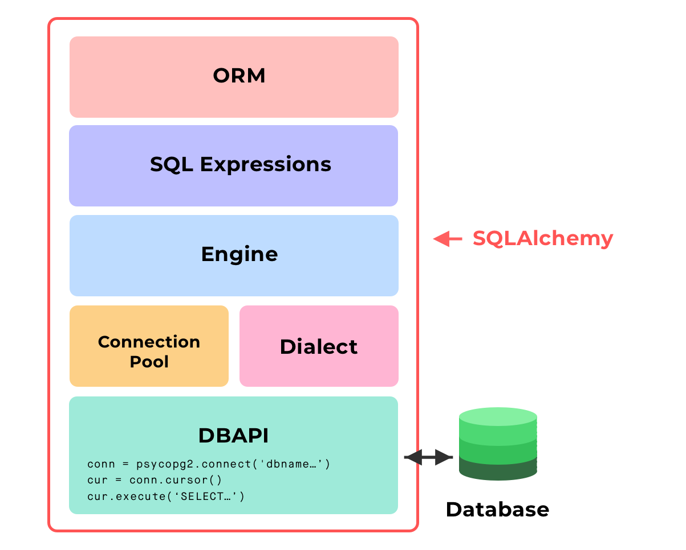

# SQLAlchemy 

- Features function-based query construction: allows SQL clauses to be built via Python functions and expressions.
- Avoid writing raw SQL. It generates SQL and Python code for you to access tables, which leads to less database-related overhead in terms of the volume of code you need to write overall to interact with your models.
- Moreover, you can avoid sending SQL to the database on every call. The SQLAlchemy ORM library features automatic caching, caching collections, and references between objects once initially loaded.

## SQLAlchemy vs psycopg2
- SQLAlchemy generates SQL statements
- psycopg2 directly sends SQL statements to the database.
- SQLAlchemy depends on psycopg2 or other database drivers to communicate with the database, under the hood.

## Layers of SQLAlchemy
1. DBAPI
2. The Dialect
3. The Connection Pool
4. The Engine
5. SQL Expressions
6. SQLAlchemy ORM (optional)



## Engine:
### Takeaways The Engine
- 1 of 3 main layers for how you may choose to interact with the database.
- Is the lowest level layer of interacting with the database, and is much like using the DBAPI directly. Very similar to using psycopg2, managing a connection directly.

Moreover,
- The Engine in SQLAlchemy refers to both itself, the Dialect and the Connection Pool, which all work together to interface with our database.
- A connection pool gets automatically created when we create an SQLAlchemy engine.

>```python 
> from snowflake.sqlalchemy import URL
> from sqlalchemy import create_engine
> from sqlalchemy.dialects import registry
>
> engine = create_engine(URL(
>       account=snowflake.account,
>       authenticator=snowflake.authenticator,
>       user=user,
>       password=password,
>       database=database,
>       schema=schema,
>       warehouse=warehouse,
>       role=role
>   ))
> con = engine.connect()
> result = con.execute(f'Select * ...')
> row = result.fetchone()
> row = result.fatchall()
> 
> con.close()
>```

## SQL Expressions
### Takeaways
- Instead of sending raw SQL (using the Engine), we can compose python objects to compose SQL expressions, instead.
- SQL Expressions still involves using and knowing SQL to interact with the database.

>```python 
> todos = Table('todos', ...)
> ins = todos.insert().values(
>   description = 'Clean my room',
>   completed = False
> )
> s = select([todos])
> conn = engine.connect()
> result = engine.execute(ins)
> result = conn.execute(s)
>
> result.close()
>
> todos.c.description # <Column description in todos table>
>```

## ORM


Sets a cursor to begin executing commands
>```python 
> cursor = connection.cursor()
>```

# References
    https://www.youtube.com/watch?v=HBH0b5n7bpU&t=108s


