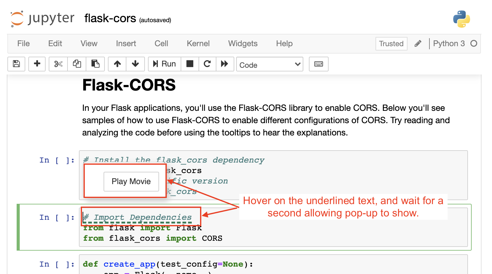

# APIs

## What are APIs?
- If you look up the term API, you'll probably find a number of definitions—some of which are rather difficult to understand. But the key underlying idea is in the name—Application Programming Interface. An API is an interface. It's something that has been created to help two different systems interact with one another.
- A key idea to remember is that API functionality is defined independently of the actual implementation of the provider. Essentially, you don't need to understand the entirety of the application implementation in order to interact with it through the API. This has multiple benefits:

    + It doesn't expose the implementation to those who shouldn't have access to it
    + The API provides a standard way of accessing the application
    + It makes it much easier to understand how to access the application's data
## RESTful APIs
- If you've done some research into developing APIs, you may have come across the term RESTful API. REST stands for Representational State Transfer, which is an architectural style introduced by Roy Fielding in 2000.

- Here's a short summary of the REST principles:
    + Uniform Interface: Every rest architecture must have a standardized way of accessing and processing data resources. This includes unique resource identifiers (i.e., unique URLs) and self-descriptive messages in the server response that describe how to process the representation (for instance JSON vs XML) of the data resource.
    + Stateless: Every client request is self-contained in that the server doesn't need to store any application data in order to respond to subsequent requests
    + Client-Server: There must be both a client and server in the architecture
    + Cacheable & Layered System: Caching and layering increases networking efficiency

## HTTP Request Methods
Different request methods indicate different operations to be performed. It's essential to attend to this to correctly format your requests and properly structure an API.

- GET: ONLY retrieves information for the requested resource of the given URI
- POST: Send data to the server to create a new resource.
- PUT: Replaces all of the representation of the target resource with the request data
- PATCH: Partially modifies the representation of the target resource with the request data
- DELETE: Removes all of the representation of the resource specified by the URI
- OPTIONS: Sends the communication options for the requested resource

## HTTP Response
- https://httpstatusdogs.com

### Codes fall into five categories:
- 1xx Informational
- 2xx Success
- 3xx Redirection
- 4xx Client Error
- 5xx Server Error

### Common Codes:
- 200: OK
- 201: Created
- 304: Not Modified
- 400: Bad Request
- 401: Unauthorized
- 404: Not Found
- 405: Method Not Allowed
- 500: Internal Server Error

### Curl


## Organizing API endpoints / Principles

When organizing API endpoints, they should be based on the resources instead of on actions. The request methods will determine what action should be taken at a given URL endpoint. Your entire API's scheme should be consistent, clear and concise. Below are the principles and examples from the video, for your reference:

- Should be intuitive
- Organize by resource
    + Use nouns in the path, not verbs
    + The method used will determine the operation taken
    + GOOD: `https://example.com/posts`
    + BAD: `https://example.com/get_posts`
- Keep a consistent scheme
    + Plural nouns for collections
    + Use parameters to specify a specific item
    + GOOD:
        + `https://example.com/entrees`
        + `https://example.com/entrees/5`
    + BAD:
        + `https://example.com/entree`
        + `https://example.com/entree_five`

- Don’t make them too complex or lengthy
    + No longer than collection/item/collection
    + GOOD: `https://example.com/entrees/5/reviews`
    + BAD: `https://example.com/entrees/5/customers/4/reviews`

## CORS headers

### In order for the requests to be processed properly, CORS utilizes headers to specify what the server will allow:

- Access-Control-Allow-Origin: What client domains can access its resources. For any domain use *
- Access-Control-Allow-Credentials: Only if using cookies for authentication - in which case its value must be true
- Access-Control-Allow-Methods: List of HTTP request types allowed
- Access-Control-Allow-Headers: List of http request header values the server will allow, particularly useful if you use any custom headers

### Document
- https://developer.mozilla.org/en-US/docs/Web/HTTP/CORS

## Flask-CORS
- [Flask-CORS](https://flask-cors.readthedocs.io/en/latest/) is the extension for handling CORS and its installation and usage are very simple. 


### Installation
>```Terminal
> pip install -U flask-cors
>```

### Simple Usage
See the full list of options in the [documentation](https://flask-cors.corydolphin.com/en/latest/api.html#extension).

>```python
> from flask import Flask
> from flask_cors import CORS
> 
> app = Flask(__name__)
> CORS(app)
> 
> @app.route("/")
> def helloWorld():
>   return "Hello, cross-origin-world!"
>```

### Resource specific CORS
Alternatively, you can specify CORS options on a resource and origin level of granularity by passing a dictionary as the resources option, mapping paths to a set of options. See the full list of options in the documentation.

>```python
> app = Flask(__name__)
> cors = CORS(app, resources={r"/api/*": {"origins": "*"}})
> 
> @app.route("/api/v1/users")
> def list_users():
>   return "user example"
>```

### Route specific CORS via decorator
This extension also exposes a simple decorator to decorate flask routes with. Simply add @cross_origin() below a call to Flask’s @app.route(..) to allow CORS on a given route. See the full list of options in the decorator documentation.

>```python
> @app.route("/")
> @cross_origin()
> def helloWorld():
>   return "Hello, cross-origin-world!"
>```

## Flask Route Decorator

>```python
> @app.route('/hello', methods=['GET', 'POST'])
> def greeting():
>     if request.method == 'POST':
>         return create_greeting()
>     else:
>         return send_greeting()
>```


# Unit Test

## Unit test Flask Key Structures
As we just saw, all of your Flask application tests will follow the same format:

- **Define the test case class** for the application (or section of the application, for larger applications).
- **Define and implement the `setUp` function.** It will be executed before each test and is where you should initialize the app and test client, as well as any other context your tests will need. The Flask library provides a test client for the application, accessed as shown below.
- **Define the `tearDown` method**, which is implemented after each test. It will run as long as setUp executes successfully, regardless of test success.
- **Define your tests**. All should begin with `test_` and include a doc string about the purpose of the test. In defining the tests, you will need to:
    + Get the response by having the client make a request
    + Use `self.assertEqual` to check the status code and all other relevant operations.
- Run the test suite, by running python `test_file_name.py` from the command line.

Here's that same code (from the notebook above), for your reference:

>```python
> #Import all dependencies
> import unittest
> import json
> from flaskr import create_app
> from models import setup_db
> 
> class AppNameTestCase(unittest.TestCase):
>     """This class represents the ___ test case"""
> 
>     def setUp(self):
>         """Executed before each test. Define test variables and initialize app."""
>         self.client = app.test_client
>         pass
> 
>     def tearDown(self):
>         """Executed after reach test"""
>         pass
> 
>     def test_given_behavior(self):
>         """Test _____________ """
>         res = self.client().get('/')
> 
>         self.assertEqual(res.status_code, 200)
> 
> # Make the tests conveniently executable
> if __name__ == "__main__":
> unittest.main()
>```


# API Documentation Practice
In this exercise, your task is to practice writing documentation for the bookstore app we created earlier.

You'll soon be writing documentation for your final project (the Trivia API), after which you'll get feedback from a reviewer. You can think of this as some rudimentary practice to prepare for that.

At each step, you can compare what you've written with our own version. Of course, **there isn't a single correct way to write a piece of documentation**, so your version may look quite different. However, there are principles and practices you should follow in order to produce quality documentation, and we'll point this out so you can check whether you've incorporated them in what you wrote.

## Getting started
Now, add a Getting Started section to your documentation. Remember, this should include at least your base URL and an explanation of authentication. Feel free to provide other information that is relevant for your API


## Error Handling
Now, add an Error Handling section to your documentation. It should include the format of the error responses the client can expect as well as which status codes you use.
- Response codes
- Messages
- Error types

## Endpoint Library
Now, add an Endpoint Library section to your documentation. Make sure that endpoints, methods and returned data are all clear. Consider including sample requests for clarity

- Organized by resource
- Include each endpoint
- Sample request 
- Arguments including data types
- Response object including status codes and data types 


# References
## Some frequently used APIS:
- [Google Maps API](https://developers.google.com/maps/documentation/) allows users to access a large amount of data related to maps, routes, and places around the world.
- [Facebook API](https://developers.facebook.com/docs) allows developers to integrate directly with the Facebook platform.
- [Spotify API](https://developer.spotify.com/documentation/web-api) allows users to access a large amount of data related to music artists, albums, and tracks, directly from the Spotify Data Catalogue.

## Article
- https://blog.postman.com/intro-to-apis-what-is-an-api/
- [What exactly is RESTful programming?](https://stackoverflow.com/questions/671118/what-is-restful-programming) Stack overflow article about RESTful programming.
- [Best practices for REST API design](https://stackoverflow.blog/2020/03/02/best-practices-for-rest-api-design/) which looks at how to design REST APIs to be easy to understand, future-proof, secure, and fast.