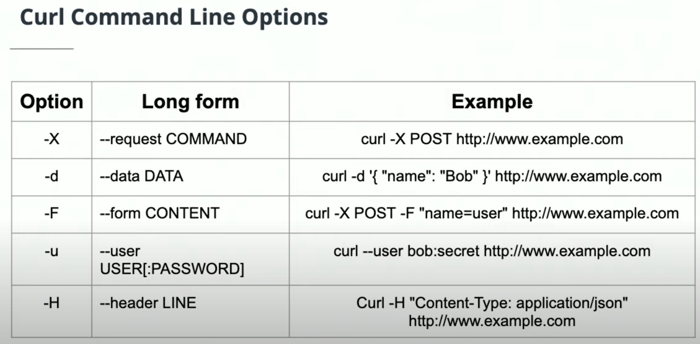

# APIs

## What are APIs?
- If you look up the term API, you'll probably find a number of definitions—some of which are rather difficult to understand. But the key underlying idea is in the name—Application Programming Interface. An API is an interface. It's something that has been created to help two different systems interact with one another.
- A key idea to remember is that API functionality is defined independently of the actual implementation of the provider. Essentially, you don't need to understand the entirety of the application implementation in order to interact with it through the API. This has multiple benefits:

    + It doesn't expose the implementation to those who shouldn't have access to it
    + The API provides a standard way of accessing the application
    + It makes it much easier to understand how to access the application's data
## RESTful APIs
- If you've done some research into developing APIs, you may have come across the term RESTful API. REST stands for Representational State Transfer, which is an architectural style introduced by Roy Fielding in 2000.

- Here's a short summary of the REST principles:
    + Uniform Interface: Every rest architecture must have a standardized way of accessing and processing data resources. This includes unique resource identifiers (i.e., unique URLs) and self-descriptive messages in the server response that describe how to process the representation (for instance JSON vs XML) of the data resource.
    + Stateless: Every client request is self-contained in that the server doesn't need to store any application data in order to respond to subsequent requests
    + Client-Server: There must be both a client and server in the architecture
    + Cacheable & Layered System: Caching and layering increases networking efficiency

## HTTP Request Methods
Different request methods indicate different operations to be performed. It's essential to attend to this to correctly format your requests and properly structure an API.

- GET: ONLY retrieves information for the requested resource of the given URI
- POST: Send data to the server to create a new resource.
- PUT: Replaces all of the representation of the target resource with the request data
- PATCH: Partially modifies the representation of the target resource with the request data
- DELETE: Removes all of the representation of the resource specified by the URI
- OPTIONS: Sends the communication options for the requested resource

## HTTP Response
- https://httpstatusdogs.com

### Codes fall into five categories:
- 1xx Informational
- 2xx Success
- 3xx Redirection
- 4xx Client Error
- 5xx Server Error

### Common Codes:
- 200: OK
- 201: Created
- 304: Not Modified
- 400: Bad Request
- 401: Unauthorized
- 404: Not Found
- 405: Method Not Allowed
- 500: Internal Server Error

### Curl


>```php
> id |   description   
>----+-----------------
>  1 | this is a thing
> (1 row)
>```


# References
## Some frequently used APIS:
- [Google Maps API](https://developers.google.com/maps/documentation/) allows users to access a large amount of data related to maps, routes, and places around the world.
- [Facebook API](https://developers.facebook.com/docs) allows developers to integrate directly with the Facebook platform.
- [Spotify API](https://developer.spotify.com/documentation/web-api) allows users to access a large amount of data related to music artists, albums, and tracks, directly from the Spotify Data Catalogue.

## Article
- https://blog.postman.com/intro-to-apis-what-is-an-api/
- [What exactly is RESTful programming?](https://stackoverflow.com/questions/671118/what-is-restful-programming) Stack overflow article about RESTful programming.
- [Best practices for REST API design](https://stackoverflow.blog/2020/03/02/best-practices-for-rest-api-design/) which looks at how to design REST APIs to be easy to understand, future-proof, secure, and fast.