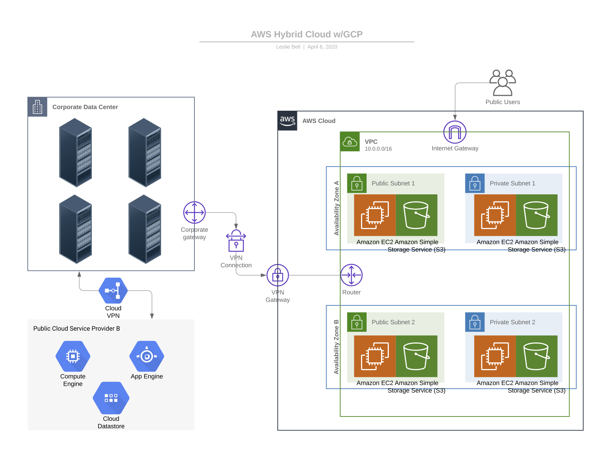
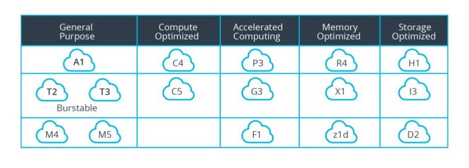
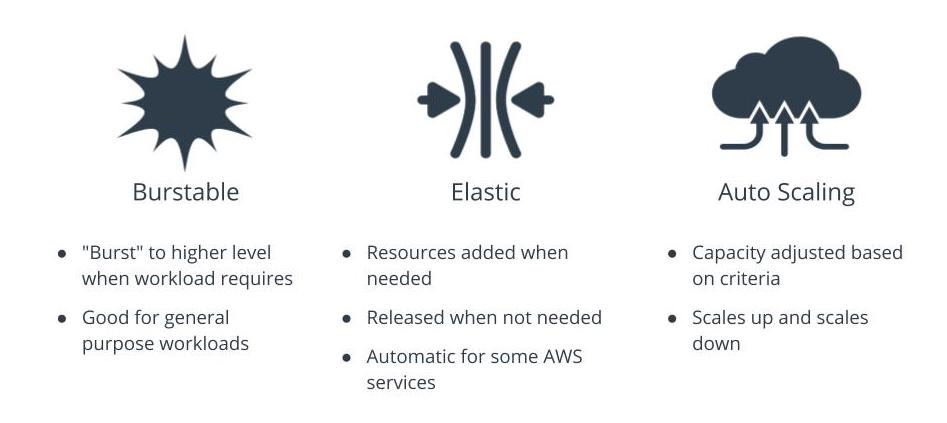

# AWs
## Terms

|Term| Definition|
|---|---|
|11 9’s guarantee|99.999999999% durability of objects over a given year. This durability level corresponds to an average annual expected loss of 0.000000001% of objects|
|Availability Zones|A logical data center in an AWS region with redundant and separate power, networking and connectivity reducing the likelihood of two zones failing simultaneously|
|AWS CloudFront|Fast content delivery network (CDN) service that securely delivers data, videos, applications, and APIs to customers globally with low latency|
|AWS Local Zones|A type of AWS infrastructure deployment that places AWS compute, storage, database, and other select services closer to large population, industry, and IT centers where no AWS Region exists today|
|AWS Regions|A geographical location with a collection of availability zones physically isolated from and independent of every other region|
|AWS Support|Paid support plans offering AWS customers access to AWS technical experts and professional guidance|
|Durability|The probability that the object will remain intact and accessible after a period of one year|
|Edge Location|A physical site that CloudFront uses to cache copies of your content for faster delivery to users at any location|
|Fault Tolerance|The property that enables a system to continue operating properly in the event of the failure of (or one or more faults within) some of its components|
|High Availability|Refers to systems that are durable and likely to operate continuously without failure for a long time|
|Memory-Optimized|The R3 instance class recommended for applications that require high memory performance|
|Points of Presence|AWS Edge Locations and Regional Edge Caches used for both AWS CloudFront and Lambda@Edge to deliver content to end users at high speeds|
|Storage-Optimized|Instances are designed for workloads that require high, sequential read and write access to very large data sets on local storage. They are optimized to deliver tens of thousands of low-latency, random I/O operations per second (IOPS) to applications|
|VPC Peering|A networking connection between two AWS VPCs that allows you to route traffic between them using private IP addresses|
|VPC Sharing|allows you to share subnets with other AWS accounts in your organization|

## Pricing for EC2 Instances in AWS
AWS EC2 instance pricing is straightforward, but it can quickly become complex when you take up the task of optimizing your environment to achieve the ideal cost/performance balance.

- Explore OS licensing pricing and options
- Limit the users and roles that can launch production instances
- Choose the best instance for your workload
- Save by moving to new generation instances when available

### Purchasing Options

|Option| How it Works|
|---|---|
|Capacity Reservations|Reserve capacity for your EC2 instances in a specific Availability Zone for any duration.|
|Dedicated Hosts|Pay for a physical host that is fully dedicated to running your instances, and bring your existing per-socket, per-core, or per-VM software licenses to reduce costs.|
|Dedicated Instances|Pay, by the hour, for instances that run on single-tenant hardware.|
|On-Demand Instances|An AWS service or technology that can be acquired at any time for a predetermined standard cos|
|Reserved Instances|An AWS service or technology that can be reserved for a period of time at a discount in exchange for a payment commitment|
|Savings Plans|Reduces your Amazon EC2 costs by making a commitment to a consistent amount of usage, in USD per hour, for a term of 1 or 3 years.|
|Scheduled Instances|Purchase instances that are always available on the specified recurring schedule, for a one-year term.|
|Spot Instances|an EC2 instance that can be acquired by bidding for a low price in exchange for the understanding that AWS can reclaim it at any time|

- https://www.youtube.com/watch?v=px2Iko_Ezao&t=269s

### Reserved and Spot Instances
Reserved instances are a 1 or 3 year commitment and multiple payment options also save money,
Spot instances can be terminated by AWS at any time with a 2 minute notification that you might not see
On demand instances are the most expensive option and should only be used in short-term or urgent situations.

- https://www.youtube.com/watch?v=rlQjQ9XKs2o&t=181s

## Storage Pricing
- Storage costs vary considerably depending on usage and requirements.
- Applications require different types of optimized storage depending on their primary function.

- https://www.youtube.com/watch?v=855-ZH2W7C0

|Term|	Definition|
|---|---|
|Edge Cache|	A high-speed data storage layer which stores a subset of data, typically transient in nature, close to the end user so that future requests for that data are served up faster
|EBS|	Elastic Block Store - cloud-based and pre-allocated linux-based block storage system provided by Amazon Web Services (AWS) that is best used for storing persistent data
|EFS|	Elastic File System - a simple, scalable, elastic, and encrypted file storage system that can be used by concurrent compute resources in the AWS cloud and on-premises
|HDD|	Category of EBS hard disk drive. Can be throughput optimized (workhorse) or cold (infrequently scanned)
|Lifecycle Policies|	Automate the actions you want to take on an object in an S3 bucket over its lifetime, for example, move them to another storage class, archive them after a number of days or years, or delete them.
|S3|	Amazon Simple Storage Service is general purpose object storage used for frequently accessed files
|S3 Endpoints|	A private connection between your VPC and S3 that doesn’t require internet access, potentially reducing NAT gateway costs
|SSD|	Category of EBS solid-state drive. Can be IOPS optimized for databases (fast) or general-purpose for boot volumes and dev/test systems
|Storage Cache|	A high-speed data storage layer that stores a subset of typically transient data
|Tagging|	Allows you to name and classify S3 buckets. AWS can provide a usage and cost report based on tags

## AWS Managed Databases

|Term|	Definition
|---|---|
|AWS Aurora|	fully managed MySQL-compatible relational database engine that combines the speed and availability of commercial databases with the simplicity and cost-effectiveness of open source databases. Aurora is VERY fast-10 times as fast as Microsoft SQL, but slightly more costly
|AWS DynamoDB|	is a very fast scalable NoSQL database service that manages distri­buted replicas of your data for high availa­bility
|AWS RDS|	simplifies the process of configuring, operating, and scaling familiar relational databases in the cloud. Provides cost-efficient and resizable capacity for an industry-standard relational database and manages common database administration tasks
|BLOBS (Binary Large Objects)|	binary data including videos, images, gifs, and audio files
|BYOL|	A licensing model that lets companies use their licenses flexibly, whether on-premise, or in the cloud
|CLOBs (Character Large Objects)|	text data including text files, PDF documents, word processing documents
|DBA|	A Database Architect is responsible for designing, deploying and managing the data architecture for an organization.
|NoSQL Databases (a.k.a. Non-relational Databases)|	Built for specific data models with flexible schemas for building modern applications and widely recognized for their ease of development, functionality, and performance at scale
|Read Replica|	A read-only copy of a database instance; applications can connect to a read replica just as they would to any DB instance
|AWS Outposts|	A hybrid cloud service that includes a physical AWS compute and storage appliance that resides on -premises in the customer datacenter
|Hybrid Cloud|	A mix of public cloud, private cloud on-premise data centers and edge locations

## Implementing Hybrid Cloud
- https://www.youtube.com/watch?v=hoQMkFTdOdI
- https://www.youtube.com/watch?v=dbk8TCa5tnI&t=1s

- Connecting the on premises data center to the cloud provider requires networking expertise and support from the network team and the cloud technology team
- Connectivity is secured via customer managed gateway and VPN or by AWS Direct Connect
- Data is encrypted end-to-end
- The VPC provides and manages all of the connections into the cloud environment and resources

- Public subnets  
    - Have an internet gateway for routes out to the internet from the VPC
    - Used for public facing servers like web servers, bastion hosts, proxies, and VPNs
- Private subnets
    - No route to the internet -- but can access the internet using a NAT gateway which is a one-way connection out to the internet
    - Used for backend servers like databases and internal load balancers

- Hybrid Cloud Diagram
    + In this environment, we have:
        + two public cloud providers (AWS and GCP)
        + one corporate data center.
    + The cloud environments are connected to the corporate data center through a VPN connection.
    + The AWS VPN gateway is managed on the AWS side by the AWS Cloud architects and network engineers
    + The corporate gateway is managed by the on-premises network engineers. - - The gateways are secured via their local protocols and connected via a secure VPN connection.
    + This environment allows the Cloud to share data and resources with the corporate on-premises colo data center.

[What is Hybrid Cloud](https://www.netapp.com/hybrid-cloud/what-is-hybrid-cloud/)
[Hybrid Cloud with AWS](https://aws.amazon.com/hybrid/)
[Hybrid Cloud Storage](https://aws.amazon.com/products/storage/hybrid-cloud-storage/)
[AWS Outposts](https://aws.amazon.com/outposts/)
[AWS Storage Gateway](https://aws.amazon.com/storagegateway/)
[AWS DataSync](https://aws.amazon.com/datasync/)
[AWS Snowball Edge](https://aws.amazon.com/snowball/)
[Hybrid Cloud on AWS (video)](https://pages.awscloud.com/Introduction-to-Hybrid-Cloud-on-AWS_0315-CMP_OD.html)

## Autoscaling
- Scaling can add/remove system resources (vertical scaling) or add/remove nodes or workers (horizontal scaling)
- Scalable AWS resources include
    + EC2
    + EC2 Spot Fleets
    + ECS
    + DynamoDB
    + AWS Aurora

|Vertical Scalin|	Horizontal Scaling|
|---|---|
|Scaling Up and Down|	Scaling Out and In|
|Adding more resources to the system (memory and CPU)|	Adding more nodes or workers|
|Change size of EC2 Instances|	Change number of EC2 Instances|

- Scaling out is the process of adding more resources to spread out a workload. An example would be adding servers to a load balancer to share a workload. Scaling up is the process of making a resource larger and more powerful in response to an increased workload. An example would be adding RAM or CPUs to a server so it can manage an increase in demand.
- Scaling out is also referred to as horizontal scaling
- Scaling up is also referred to as vertical scaling
- https://www.youtube.com/watch?v=o4TlkS4j894

## AWS Cost Optimization Tools and Services
- AWS Cost Explorer - Enables you to view and analyze your costs and usage in a graph or a report. Cost Explorer is very useful in forecasting costs and predicting where reserved instances may offer cost savings. 
- AWS Cost Optimization Monitor - Analyzes your billing reports and pulls out metrics to make them searchable and displays them in a customizable dashboard for analysis 
- AWS Code Guru - Helps you proactively improve code quality and application performance with intelligent recommendations. It reviews your code and finds code issues during code reviews before they reach production, including needlessly costly lines of code, race conditions, memory leaks, and runaway logging. 
- AWS Solution Architects - Professional AWS certified engineers who are deployed by AWS to assist customers in solving the most challenging engineering problems. Costs for this assistance vary based on your support agreement and of course, the relative value of your account. 
- AWS Account Credits - Credits are available for startups, non-profits, and academic institutions. It never hurts to ask for AWS credits no matter who you are.

- If you receive a large bill from AWS for a configuration mistake- for example, you may have opened a stream from a source that sends too much data to AWS or mistakenly uploaded a very large data set multiple times, you should first find out where you made your mistake so you can correct it as soon as possible. After you are certain you have mitigated your error and no additional unwanted charges are accumulating, reach out to AWS and explain what happened. In many cases, especially during your yearlong free tier testing, they will be understanding and reverse the charges, but there are no guarantees.

- Unfortunately, they are not going to refund charges when you are surprised and disappointed by how much your crypto mining operations cost, versus how much currency you accumulated, so procure your AWS resources wisely.

- Always make sure you configure a billing alarm for your account. Billing alarms prevent shocking surprise bills.

Key Points
Costs in the cloud have no equivalent in the data center because cloud services are billed like utilities - you only pay for what you use 
Costs vary between AWS Regions based on location, regulations, utilities, real estate costs, and the cost of doing business 
AWS can help architects by providing several calculation and cost optimization services to ensure customers are running cost and performance optimized workloads whenever possible 
AWS offers significant discounts when you commit to compute and when you need compute for fault-tolerant applications

Glossary

|Term|	Definition|
|---|---|
|11 9’s guarantee|	99.999999999% durability of objects over a given year. This durability level corresponds to an average annual expected loss of 0.000000001% of objects|
|AMI (Amazon Machine Image)|	Provides the configuration details needed to launch an EC2 instance|
|Autoscaling/ Auto Scaling|	Automatic changes that add or remove compute resources|
|Availability Zones|	A logical data center in an AWS region with redundant and separate power, networking and connectivity reducing the likelihood of two zones failing simultaneously|
|AWS Aurora|	Fully-managed MySQL-compatible relational database engine that combines the speed and availability of commercial databases with the simplicity and cost-effectiveness of open source databases. Aurora is VERY fast-10 times as fast as Microsoft SQL, but slightly more costly|
|AWS CloudFront|	Fast content delivery network (CDN) service that securely delivers data, videos, applications, and APIs to customers globally with low latency|
|AWS DynamoDB|	Very fast scalable NoSQL database service that manages distri­buted replicas of your data for high availa­bility|
|AWS Local Zones|	A type of AWS infrastructure deployment that places AWS compute, storage, database, and other select services closer to large population, industry, and IT centers where no AWS Region exists today|
|AWS Outposts|	A hybrid cloud service that includes a physical AWS compute and storage appliance that resides on-premise in the customer datacenter|
|AWS RDS|	Relational database that simplifies the process of configuring, operating, and scaling. Provides cost-efficient and resizable capacity for an industry-standard relational database and manages common database administration tasks|
|AWS Regions|	A geographical location with a collection of availability zones physically isolated from and independent of every other region|
|AWS Support|	Paid support plans offering AWS customers access to AWS technical experts and professional guidance|
|BLOBS (Binary Large Objects)|	Used to store binary data including videos, images, gifs, and audio files|
|BYOL|	A licensing model that lets companies use their licenses flexibly, whether on-premise, or in the cloud|
|Capacity Reservations|	Reserve capacity for your EC2 instances in a specific Availability Zone for any duration.|
|CLOBs (Character Large Objects)|	Used to store text data including text files, PDF documents, word processing documents|
|DBA|	A Database Architect is responsible for designing, deploying and managing the data architecture for an organization.|
|Dedicated Hosts|	Pay for a physical host that is fully dedicated to running your instances, and bring your existing per-socket, per-core, or per-VM software licenses to reduce costs.|
|Dedicated Instances|	Pay, by the hour, for instances that run on single-tenant hardware.|
|Durability|	The probability that the object will remain intact and accessible after a period of one year|
|EBS|	Elastic Block Store - cloud-based block storage system provided by Amazon Web Services (AWS) that is best used for storing persistent data|
|EC2 Spot Fleet|	A collection of EC2 Spot and On-Demand instances|
|Edge Cache|	A high-speed data storage layer which stores a subset of data, typically transient in nature, close to the end user so that future requests for that data are served up faster|
|Edge Location|	A physical site that CloudFront uses to cache copies of your content for faster delivery to users at any location|
|EFS|	Elastic File System - a simple, scalable, elastic, and encrypted file storage system that can be used by concurrent compute resources in the AWS cloud and on-premises|
|Fault Tolerance|	The property that enables a system to continue operating properly in the event of the failure of (or one or more faults within) some of its components|
|HDD|	Category of EBS hard disk drive. Can be throughput optimized (workhorse) or cold (infrequently scanned)|
|High Availability|	Refers to systems that are durable and likely to operate continuously without failure for a long time|
|Horizontal Scaling|	Adding more nodes or workers a.k.a. scaling in and scaling out|
|Hybrid Cloud|	A mix of public cloud, private cloud on-premise data centers and edge locations|
|Lifecycle Policies|	Automate the actions you want to take on an object in an S3 bucket over its lifetime, for example, move them to another storage class, archive them after a number of days or years, or delete them.|
|Memory-Optimized|	The R3 instance class recommended for applications that require high memory performance|
|NoSQL Databases|	Built for specific data models with flexible schemas for building modern applications and widely recognized for their ease of development, functionality, and performance at scale|
|On-Demand Instances|	An AWS service or technology that can be acquired at any time for a predetermined standard cos|
|Points of Presence|	AWS Edge Locations and Regional Edge Caches used for both AWS CloudFront and Lambda@Edge to deliver content to end users at high speeds|
|Read Replica|	A read-only copy of a database instance; applications can connect to a read replica just as they would to any DB instance|
|Reserved Instances|	An AWS service or technology that can be reserved for a period of time iat a discount in exchange for a payment commitment|
|S3|	Amazon Simple Storage Service general purpose storage used for frequently accessed files|
|S3 Endpoints|	A private connection between your VPC and S3 that doesn’t require internet access, potentially reducing NAT gateway costs|
|Savings Plans|	Reduces your Amazon EC2 costs by making a commitment to a consistent amount of usage, in USD per hour, for a term of 1 or 3 years.|
|Scheduled Instances|	Purchase instances that are always available on the specified recurring schedule, for a one-year term.|
|SDD|	Category of EBS solid state drive. Can be IOPS optimized for databases (fast) or general purpose for boot volumes and dev/test systems|
|Spot Instances|	an EC2 instance that can be acquired by bidding for a low price in exchange for the understanding that AWS can reclaim it at any time|
|Storage Cache|	A high-speed data storage layer that stores a subset of typically transient data|
|Storage-Optimized|	Instances are designed for workloads that require high, sequential read and write access to very large data sets on local storage. They are optimized to deliver tens of thousands of low-latency, random I/O operations per second (IOPS) to applications|
|Tagging|	Allows you to name and classify S3 buckets. AWS can provide a usage and cost report based on tags|
|Vertical Scaling|	Adding more resources to the system (memory and CPU) a.k.a. scaling up and down|
|VPC Peering|	A networking connection between two AWS VPCs that allows you to route traffic between them using private IP addresses|
|VPC Sharing|	allows you to share subnets with other AWS accounts in your organization|

## Best Practices for Optimizing for Performance
- Design your workload infrastructure with performance in mind from the start
- Whenever possible, design your workload or application to be cloud native
- Utilize compute elasticity to manage performance peaks and valleys
- Optimize until your performance meets benchmarks

## Scaling, Elasticity, and Bursting
The three primary functions built in to AWS to address increases in compute demand are bursting, elasticity and scaling

Burstable instances provide your application a baseline level of CPU performance with the ability to burst to a higher level when required by your workload. These instances are great for workloads like fast interactive applications, moderately sized databases, and lower lifecycles like Development and test.. AWS burstable instances are T2 and T3 instance types.
Elasticity is the ability to acquire resources as you need them, and elasticity is ALSO releasing resources when you no longer need them. A service isn’t elastic unless it releases resources it no longer needs, another major cloud differentiator.
AWS Auto Scaling monitors your applications based on criteria you specify and automatically adjusts capacity to maintain availability and performance. Autoscaling is an example of scaling up when you add servers as you need them, and scaling down when you wind down and terminating servers you no longer need

## Storage and Latency

### Simple Storage Service (S3)
- Highly durable object storage optimized for media files
- Guarantees 99.999999999% availability

### Elastic Block Store (EBS)
- EC2 attached block storage comprised of workload specific hard drives
- Must be provisioned in advance, so you may end up paying for storage you are not using

### Elastic File System( EFS)
- Elastic file storage for named files that require a file structure, such as big data workloads and web sites.
- Truly elastic and it will expand and contract as you use it.

### Best Practices for Optimized Object Storage
- Spread connection requests to maximize the accessible bandwidth
- Access in the same AWS Region when possible to reduce latency and data transfer costs
- Use AWS S3 Transfer Acceleration for fast and secure data transfer over long distances
- Use Instance Store for ephemeral storage
- Always delete unused storage volumes and obsolete snapshots!!!

### Storage Solutions
|Object Storage|	Block Storage|	File Storage|
|---|---|---|
|General purpose for media content, static HTML and archived documents|	Data that requires long-term persistence and quick access|	Scalable file storage for big data, media processing, content management etc.|
|Highest level of durability|	Must be provisioned in advance|	No need to provision in advance|
|3 tiers for hot, warm or cold data|	Pay whether you use it or not|	Designed for high throughput and low latency|

### New Terms
|Term|	Definition|
|---|---|
|Availability|	A storage volume’s ability to deliver data upon request|
|Data Durability|	Refers to long-term data protection, so the stored data does not suffer from degradation or some other corruption. |Durability is focused on redundancy, so data is never lost or compromised|
|Elastic Block Store|	High performance block storage service designed for use with Amazon Elastic Compute Cloud (EC2) for both throughput and transaction intensive workloads|
|Elastic File System|	Fully managed elastic NFS file system for use with AWS Cloud services and on-premises resources. It is built to scale on demand to petabytes without disrupting applications, growing and shrinking automatically|
|IOPS|	Input/output operations per second (IOPS, pronounced eye-ops) is an input/output performance measurement used to benchmark computer storage devices like hard disk drives (HDD), solid state drives (SSD)|
|Performance|	Refers to the number of IOPS or the amount of throughput (measured in megabytes per second) that the storage volume can deliver|
|Throughput|	Measurement of data that can be transferred from one location to another in a given amount of time used to measure the performance of hard drives and RAM as well as Internet and network connections|
|Transient or Ephemeral Data|	Data created within an application session, and at the end of the session, it is discarded or reset back to its default and not stored|

## EBS and EFS

https://www.youtube.com/watch?v=h2KSnA9eeiU

### Amazon EBS or Elastic Block Storage is provisioned capacity and performance
- You pay for the EBS storage even if it is unattached or has very low read/write activity.
- Audit your environment to detect and delete obsolete EBS volumes and adjust the size of your provisioned storage to match your actual use.
- EBS volumes attached to EBS optimized instances can be accessed using dedicated networks for better throughput
- Non-EBS optimized instances share the network with all the rest of the local traffic

### Amazon EFS or Elastic File Storage has optimization built into the service
- Distributed to make it highly available, durable, and scalable.
- Can be mounted on up to thousands of Amazon EC2 instances concurrently
- Supports encryption in transit and encryption at rest with a minimal effect on I/O latency and throughput

### Key Points
- Amazon Elastic File System is a scalable NFS file system that grows and shrinks elastically as you add and remove files. There is no need to provision EFS storage, and you only pay for what you use.
- AWS EFS files can be automatically moved to a lower infrequently accessed tier (EFS-IA) after they haven’t been accessed for a certain period of time.
- EFS supports any number of concurrent EC2 instance connections. Thousands of connections is not uncommon.

- https://www.youtube.com/watch?v=EtK3MjeYS94&t=191s

## Elastic Block Storage - EBS
- https://www.youtube.com/watch?v=IwmMixJDXoE

### Key Points
- EBS volumes are highly durable block storage hard drives that can either be created independently on the EBS management page or created with a new EC2 instance
- EBS volumes can be attached to and detached from instances and can be used just like any other hard drive- you can run databases, create file systems, and move them between instances
- EBS volumes are provisioned storage, so costs are incurred whether it is attached to an EC2 instance or not. Be mindful of idle EBS volumes and make sure they are necessary before you maintain unused volumes for long periods of time.
- EBS snapshots are point-in-time backups of EBS volumes saved to S3 and serve as a lower cost alternative to maintaining idle EBS volumes
- AWS EBS provides SSD or HDD volumes. SSD are for low latency/high performance applications like databases and HDD are for high throughput applications like big data workloads and infrequently accessed files in cold storage.
- Costs with EBS HDD are considerably lower than EBS SSD

|---|Solid State Drive (SSD)||Solid State Drive (SSD)|Hard Disk Drive (HDD)|Hard Disk Drive (HDD)|
|---|---|---|---|---|
|Type|	General Purpose| Provisioned IOPS|	Throughput Optimized|	Cold|
|Cost|	$$$|	$$$$|	$$|	$|
|Performance|	++|	++++|	++|	+|
|Use Case|	Boot volumes, Low-latency apps|	I/O intensive databases, Mission critical applications|	Big Data, Log processing| Infrequently accessed files|

