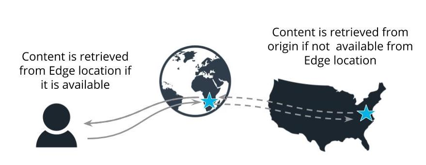
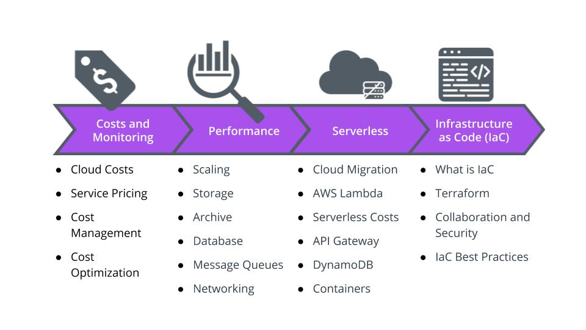

# AWs
## Terms

|Term| Definition|
|---|---|
|11 9’s guarantee|99.999999999% durability of objects over a given year. This durability level corresponds to an average annual expected loss of 0.000000001% of objects|
|Availability Zones|A logical data center in an AWS region with redundant and separate power, networking and connectivity reducing the likelihood of two zones failing simultaneously|
|AWS CloudFront|Fast content delivery network (CDN) service that securely delivers data, videos, applications, and APIs to customers globally with low latency|
|AWS Local Zones|A type of AWS infrastructure deployment that places AWS compute, storage, database, and other select services closer to large population, industry, and IT centers where no AWS Region exists today|
|AWS Regions|A geographical location with a collection of availability zones physically isolated from and independent of every other region|
|AWS Support|Paid support plans offering AWS customers access to AWS technical experts and professional guidance|
|Durability|The probability that the object will remain intact and accessible after a period of one year|
|Edge Location|A physical site that CloudFront uses to cache copies of your content for faster delivery to users at any location|
|Fault Tolerance|The property that enables a system to continue operating properly in the event of the failure of (or one or more faults within) some of its components|
|High Availability|Refers to systems that are durable and likely to operate continuously without failure for a long time|
|Memory-Optimized|The R3 instance class recommended for applications that require high memory performance|
|Points of Presence|AWS Edge Locations and Regional Edge Caches used for both AWS CloudFront and Lambda@Edge to deliver content to end users at high speeds|
|Storage-Optimized|Instances are designed for workloads that require high, sequential read and write access to very large data sets on local storage. They are optimized to deliver tens of thousands of low-latency, random I/O operations per second (IOPS) to applications|
|VPC Peering|A networking connection between two AWS VPCs that allows you to route traffic between them using private IP addresses|
|VPC Sharing|allows you to share subnets with other AWS accounts in your organization|


## Pricing for EC2 Instances in AWS
AWS EC2 instance pricing is straightforward, but it can quickly become complex when you take up the task of optimizing your environment to achieve the ideal cost/performance balance.

- Explore OS licensing pricing and options
- Limit the users and roles that can launch production instances
- Choose the best instance for your workload
- Save by moving to new generation instances when available


### Purchasing Options

|Option| How it Works|
|---|---|
|Capacity Reservations|Reserve capacity for your EC2 instances in a specific Availability Zone for any duration.|
|Dedicated Hosts|Pay for a physical host that is fully dedicated to running your instances, and bring your existing per-socket, per-core, or per-VM software licenses to reduce costs.|
|Dedicated Instances|Pay, by the hour, for instances that run on single-tenant hardware.|
|On-Demand Instances|An AWS service or technology that can be acquired at any time for a predetermined standard cos|
|Reserved Instances|An AWS service or technology that can be reserved for a period of time at a discount in exchange for a payment commitment|
|Savings Plans|Reduces your Amazon EC2 costs by making a commitment to a consistent amount of usage, in USD per hour, for a term of 1 or 3 years.|
|Scheduled Instances|Purchase instances that are always available on the specified recurring schedule, for a one-year term.|
|Spot Instances|an EC2 instance that can be acquired by bidding for a low price in exchange for the understanding that AWS can reclaim it at any time|

- https://www.youtube.com/watch?v=px2Iko_Ezao&t=269s

### Reserved and Spot Instances
Reserved instances are a 1 or 3 year commitment and multiple payment options also save money,
Spot instances can be terminated by AWS at any time with a 2 minute notification that you might not see
On demand instances are the most expensive option and should only be used in short-term or urgent situations.

- https://www.youtube.com/watch?v=rlQjQ9XKs2o&t=181s

## Storage Pricing
- Storage costs vary considerably depending on usage and requirements.
- Applications require different types of optimized storage depending on their primary function.

- https://www.youtube.com/watch?v=855-ZH2W7C0

|Term|	Definition|
|---|---|
|Edge Cache|	A high-speed data storage layer which stores a subset of data, typically transient in nature, close to the end user so that future requests for that data are served up faster
|EBS|	Elastic Block Store - cloud-based and pre-allocated linux-based block storage system provided by Amazon Web Services (AWS) that is best used for storing persistent data
|EFS|	Elastic File System - a simple, scalable, elastic, and encrypted file storage system that can be used by concurrent compute resources in the AWS cloud and on-premises
|HDD|	Category of EBS hard disk drive. Can be throughput optimized (workhorse) or cold (infrequently scanned)
|Lifecycle Policies|	Automate the actions you want to take on an object in an S3 bucket over its lifetime, for example, move them to another storage class, archive them after a number of days or years, or delete them.
|S3|	Amazon Simple Storage Service is general purpose object storage used for frequently accessed files
|S3 Endpoints|	A private connection between your VPC and S3 that doesn’t require internet access, potentially reducing NAT gateway costs
|SSD|	Category of EBS solid-state drive. Can be IOPS optimized for databases (fast) or general-purpose for boot volumes and dev/test systems
|Storage Cache|	A high-speed data storage layer that stores a subset of typically transient data
|Tagging|	Allows you to name and classify S3 buckets. AWS can provide a usage and cost report based on tags

## AWS Managed Databases

|Term|	Definition
|---|---|
|AWS Aurora|	fully managed MySQL-compatible relational database engine that combines the speed and availability of commercial databases with the simplicity and cost-effectiveness of open source databases. Aurora is VERY fast-10 times as fast as Microsoft SQL, but slightly more costly
|AWS DynamoDB|	is a very fast scalable NoSQL database service that manages distri­buted replicas of your data for high availa­bility
|AWS RDS|	simplifies the process of configuring, operating, and scaling familiar relational databases in the cloud. Provides cost-efficient and resizable capacity for an industry-standard relational database and manages common database administration tasks
|BLOBS (Binary Large Objects)|	binary data including videos, images, gifs, and audio files
|BYOL|	A licensing model that lets companies use their licenses flexibly, whether on-premise, or in the cloud
|CLOBs (Character Large Objects)|	text data including text files, PDF documents, word processing documents
|DBA|	A Database Architect is responsible for designing, deploying and managing the data architecture for an organization.
|NoSQL Databases (a.k.a. Non-relational Databases)|	Built for specific data models with flexible schemas for building modern applications and widely recognized for their ease of development, functionality, and performance at scale
|Read Replica|	A read-only copy of a database instance; applications can connect to a read replica just as they would to any DB instance
|AWS Outposts|	A hybrid cloud service that includes a physical AWS compute and storage appliance that resides on -premises in the customer datacenter
|Hybrid Cloud|	A mix of public cloud, private cloud on-premise data centers and edge locations

## Implementing Hybrid Cloud
- https://www.youtube.com/watch?v=hoQMkFTdOdI
- https://www.youtube.com/watch?v=dbk8TCa5tnI&t=1s

- Connecting the on premises data center to the cloud provider requires networking expertise and support from the network team and the cloud technology team
- Connectivity is secured via customer managed gateway and VPN or by AWS Direct Connect
- Data is encrypted end-to-end
- The VPC provides and manages all of the connections into the cloud environment and resources

- Public subnets  
    - Have an internet gateway for routes out to the internet from the VPC
    - Used for public facing servers like web servers, bastion hosts, proxies, and VPNs
- Private subnets
    - No route to the internet -- but can access the internet using a NAT gateway which is a one-way connection out to the internet
    - Used for backend servers like databases and internal load balancers

- Hybrid Cloud Diagram
    + In this environment, we have:
        + two public cloud providers (AWS and GCP)
        + one corporate data center.
    + The cloud environments are connected to the corporate data center through a VPN connection.
    + The AWS VPN gateway is managed on the AWS side by the AWS Cloud architects and network engineers
    + The corporate gateway is managed by the on-premises network engineers. - - The gateways are secured via their local protocols and connected via a secure VPN connection.
    + This environment allows the Cloud to share data and resources with the corporate on-premises colo data center.


[What is Hybrid Cloud](https://www.netapp.com/hybrid-cloud/what-is-hybrid-cloud/)
[Hybrid Cloud with AWS](https://aws.amazon.com/hybrid/)
[Hybrid Cloud Storage](https://aws.amazon.com/products/storage/hybrid-cloud-storage/)
[AWS Outposts](https://aws.amazon.com/outposts/)
[AWS Storage Gateway](https://aws.amazon.com/storagegateway/)
[AWS DataSync](https://aws.amazon.com/datasync/)
[AWS Snowball Edge](https://aws.amazon.com/snowball/)
[Hybrid Cloud on AWS (video)](https://pages.awscloud.com/Introduction-to-Hybrid-Cloud-on-AWS_0315-CMP_OD.html)

## Autoscaling
- Scaling can add/remove system resources (vertical scaling) or add/remove nodes or workers (horizontal scaling)
- Scalable AWS resources include
    + EC2
    + EC2 Spot Fleets
    + ECS
    + DynamoDB
    + AWS Aurora

|Vertical Scalin|	Horizontal Scaling|
|---|---|
|Scaling Up and Down|	Scaling Out and In|
|Adding more resources to the system (memory and CPU)|	Adding more nodes or workers|
|Change size of EC2 Instances|	Change number of EC2 Instances|

- Scaling out is the process of adding more resources to spread out a workload. An example would be adding servers to a load balancer to share a workload. Scaling up is the process of making a resource larger and more powerful in response to an increased workload. An example would be adding RAM or CPUs to a server so it can manage an increase in demand.
- Scaling out is also referred to as horizontal scaling
- Scaling up is also referred to as vertical scaling
- https://www.youtube.com/watch?v=o4TlkS4j894

## AWS Cost Optimization Tools and Services
- AWS Cost Explorer - Enables you to view and analyze your costs and usage in a graph or a report. Cost Explorer is very useful in forecasting costs and predicting where reserved instances may offer cost savings. 
- AWS Cost Optimization Monitor - Analyzes your billing reports and pulls out metrics to make them searchable and displays them in a customizable dashboard for analysis 
- AWS Code Guru - Helps you proactively improve code quality and application performance with intelligent recommendations. It reviews your code and finds code issues during code reviews before they reach production, including needlessly costly lines of code, race conditions, memory leaks, and runaway logging. 
- AWS Solution Architects - Professional AWS certified engineers who are deployed by AWS to assist customers in solving the most challenging engineering problems. Costs for this assistance vary based on your support agreement and of course, the relative value of your account. 
- AWS Account Credits - Credits are available for startups, non-profits, and academic institutions. It never hurts to ask for AWS credits no matter who you are.


- If you receive a large bill from AWS for a configuration mistake- for example, you may have opened a stream from a source that sends too much data to AWS or mistakenly uploaded a very large data set multiple times, you should first find out where you made your mistake so you can correct it as soon as possible. After you are certain you have mitigated your error and no additional unwanted charges are accumulating, reach out to AWS and explain what happened. In many cases, especially during your yearlong free tier testing, they will be understanding and reverse the charges, but there are no guarantees.

- Unfortunately, they are not going to refund charges when you are surprised and disappointed by how much your crypto mining operations cost, versus how much currency you accumulated, so procure your AWS resources wisely.

- Always make sure you configure a billing alarm for your account. Billing alarms prevent shocking surprise bills.

Key Points
Costs in the cloud have no equivalent in the data center because cloud services are billed like utilities - you only pay for what you use 
Costs vary between AWS Regions based on location, regulations, utilities, real estate costs, and the cost of doing business 
AWS can help architects by providing several calculation and cost optimization services to ensure customers are running cost and performance optimized workloads whenever possible 
AWS offers significant discounts when you commit to compute and when you need compute for fault-tolerant applications

Glossary

|Term|	Definition|
|---|---|
|11 9’s guarantee|	99.999999999% durability of objects over a given year. This durability level corresponds to an average annual expected loss of 0.000000001% of objects|
|AMI (Amazon Machine Image)|	Provides the configuration details needed to launch an EC2 instance|
|Autoscaling/ Auto Scaling|	Automatic changes that add or remove compute resources|
|Availability Zones|	A logical data center in an AWS region with redundant and separate power, networking and connectivity reducing the likelihood of two zones failing simultaneously|
|AWS Aurora|	Fully-managed MySQL-compatible relational database engine that combines the speed and availability of commercial databases with the simplicity and cost-effectiveness of open source databases. Aurora is VERY fast-10 times as fast as Microsoft SQL, but slightly more costly|
|AWS CloudFront|	Fast content delivery network (CDN) service that securely delivers data, videos, applications, and APIs to customers globally with low latency|
|AWS DynamoDB|	Very fast scalable NoSQL database service that manages distri­buted replicas of your data for high availa­bility|
|AWS Local Zones|	A type of AWS infrastructure deployment that places AWS compute, storage, database, and other select services closer to large population, industry, and IT centers where no AWS Region exists today|
|AWS Outposts|	A hybrid cloud service that includes a physical AWS compute and storage appliance that resides on-premise in the customer datacenter|
|AWS RDS|	Relational database that simplifies the process of configuring, operating, and scaling. Provides cost-efficient and resizable capacity for an industry-standard relational database and manages common database administration tasks|
|AWS Regions|	A geographical location with a collection of availability zones physically isolated from and independent of every other region|
|AWS Support|	Paid support plans offering AWS customers access to AWS technical experts and professional guidance|
|BLOBS (Binary Large Objects)|	Used to store binary data including videos, images, gifs, and audio files|
|BYOL|	A licensing model that lets companies use their licenses flexibly, whether on-premise, or in the cloud|
|Capacity Reservations|	Reserve capacity for your EC2 instances in a specific Availability Zone for any duration.|
|CLOBs (Character Large Objects)|	Used to store text data including text files, PDF documents, word processing documents|
|DBA|	A Database Architect is responsible for designing, deploying and managing the data architecture for an organization.|
|Dedicated Hosts|	Pay for a physical host that is fully dedicated to running your instances, and bring your existing per-socket, per-core, or per-VM software licenses to reduce costs.|
|Dedicated Instances|	Pay, by the hour, for instances that run on single-tenant hardware.|
|Durability|	The probability that the object will remain intact and accessible after a period of one year|
|EBS|	Elastic Block Store - cloud-based block storage system provided by Amazon Web Services (AWS) that is best used for storing persistent data|
|EC2 Spot Fleet|	A collection of EC2 Spot and On-Demand instances|
|Edge Cache|	A high-speed data storage layer which stores a subset of data, typically transient in nature, close to the end user so that future requests for that data are served up faster|
|Edge Location|	A physical site that CloudFront uses to cache copies of your content for faster delivery to users at any location|
|EFS|	Elastic File System - a simple, scalable, elastic, and encrypted file storage system that can be used by concurrent compute resources in the AWS cloud and on-premises|
|Fault Tolerance|	The property that enables a system to continue operating properly in the event of the failure of (or one or more faults within) some of its components|
|HDD|	Category of EBS hard disk drive. Can be throughput optimized (workhorse) or cold (infrequently scanned)|
|High Availability|	Refers to systems that are durable and likely to operate continuously without failure for a long time|
|Horizontal Scaling|	Adding more nodes or workers a.k.a. scaling in and scaling out|
|Hybrid Cloud|	A mix of public cloud, private cloud on-premise data centers and edge locations|
|Lifecycle Policies|	Automate the actions you want to take on an object in an S3 bucket over its lifetime, for example, move them to another storage class, archive them after a number of days or years, or delete them.|
|Memory-Optimized|	The R3 instance class recommended for applications that require high memory performance|
|NoSQL Databases|	Built for specific data models with flexible schemas for building modern applications and widely recognized for their ease of development, functionality, and performance at scale|
|On-Demand Instances|	An AWS service or technology that can be acquired at any time for a predetermined standard cos|
|Points of Presence|	AWS Edge Locations and Regional Edge Caches used for both AWS CloudFront and Lambda@Edge to deliver content to end users at high speeds|
|Read Replica|	A read-only copy of a database instance; applications can connect to a read replica just as they would to any DB instance|
|Reserved Instances|	An AWS service or technology that can be reserved for a period of time iat a discount in exchange for a payment commitment|
|S3|	Amazon Simple Storage Service general purpose storage used for frequently accessed files|
|S3 Endpoints|	A private connection between your VPC and S3 that doesn’t require internet access, potentially reducing NAT gateway costs|
|Savings Plans|	Reduces your Amazon EC2 costs by making a commitment to a consistent amount of usage, in USD per hour, for a term of 1 or 3 years.|
|Scheduled Instances|	Purchase instances that are always available on the specified recurring schedule, for a one-year term.|
|SDD|	Category of EBS solid state drive. Can be IOPS optimized for databases (fast) or general purpose for boot volumes and dev/test systems|
|Spot Instances|	an EC2 instance that can be acquired by bidding for a low price in exchange for the understanding that AWS can reclaim it at any time|
|Storage Cache|	A high-speed data storage layer that stores a subset of typically transient data|
|Storage-Optimized|	Instances are designed for workloads that require high, sequential read and write access to very large data sets on local storage. They are optimized to deliver tens of thousands of low-latency, random I/O operations per second (IOPS) to applications|
|Tagging|	Allows you to name and classify S3 buckets. AWS can provide a usage and cost report based on tags|
|Vertical Scaling|	Adding more resources to the system (memory and CPU) a.k.a. scaling up and down|
|VPC Peering|	A networking connection between two AWS VPCs that allows you to route traffic between them using private IP addresses|
|VPC Sharing|	allows you to share subnets with other AWS accounts in your organization|


## Best Practices for Optimizing for Performance
- Design your workload infrastructure with performance in mind from the start
- Whenever possible, design your workload or application to be cloud native
- Utilize compute elasticity to manage performance peaks and valleys
- Optimize until your performance meets benchmarks


## Scaling, Elasticity, and Bursting
The three primary functions built in to AWS to address increases in compute demand are bursting, elasticity and scaling

Burstable instances provide your application a baseline level of CPU performance with the ability to burst to a higher level when required by your workload. These instances are great for workloads like fast interactive applications, moderately sized databases, and lower lifecycles like Development and test.. AWS burstable instances are T2 and T3 instance types.
Elasticity is the ability to acquire resources as you need them, and elasticity is ALSO releasing resources when you no longer need them. A service isn’t elastic unless it releases resources it no longer needs, another major cloud differentiator.
AWS Auto Scaling monitors your applications based on criteria you specify and automatically adjusts capacity to maintain availability and performance. Autoscaling is an example of scaling up when you add servers as you need them, and scaling down when you wind down and terminating servers you no longer need


## Storage and Latency

### Simple Storage Service (S3)
- Highly durable object storage optimized for media files
- Guarantees 99.999999999% availability

### Elastic Block Store (EBS)
- EC2 attached block storage comprised of workload specific hard drives
- Must be provisioned in advance, so you may end up paying for storage you are not using

### Elastic File System( EFS)
- Elastic file storage for named files that require a file structure, such as big data workloads and web sites.
- Truly elastic and it will expand and contract as you use it.

### Best Practices for Optimized Object Storage
- Spread connection requests to maximize the accessible bandwidth
- Access in the same AWS Region when possible to reduce latency and data transfer costs
- Use AWS S3 Transfer Acceleration for fast and secure data transfer over long distances
- Use Instance Store for ephemeral storage
- Always delete unused storage volumes and obsolete snapshots!!!

### Storage Solutions
|Object Storage|	Block Storage|	File Storage|
|---|---|---|
|General purpose for media content, static HTML and archived documents|	Data that requires long-term persistence and quick access|	Scalable file storage for big data, media processing, content management etc.|
|Highest level of durability|	Must be provisioned in advance|	No need to provision in advance|
|3 tiers for hot, warm or cold data|	Pay whether you use it or not|	Designed for high throughput and low latency|


### New Terms
|Term|	Definition|
|---|---|
|Availability|	A storage volume’s ability to deliver data upon request|
|Data Durability|	Refers to long-term data protection, so the stored data does not suffer from degradation or some other corruption. |Durability is focused on redundancy, so data is never lost or compromised|
|Elastic Block Store|	High performance block storage service designed for use with Amazon Elastic Compute Cloud (EC2) for both throughput and transaction intensive workloads|
|Elastic File System|	Fully managed elastic NFS file system for use with AWS Cloud services and on-premises resources. It is built to scale on demand to petabytes without disrupting applications, growing and shrinking automatically|
|IOPS|	Input/output operations per second (IOPS, pronounced eye-ops) is an input/output performance measurement used to benchmark computer storage devices like hard disk drives (HDD), solid state drives (SSD)|
|Performance|	Refers to the number of IOPS or the amount of throughput (measured in megabytes per second) that the storage volume can deliver|
|Throughput|	Measurement of data that can be transferred from one location to another in a given amount of time used to measure the performance of hard drives and RAM as well as Internet and network connections|
|Transient or Ephemeral Data|	Data created within an application session, and at the end of the session, it is discarded or reset back to its default and not stored|

## EBS and EFS

https://www.youtube.com/watch?v=h2KSnA9eeiU

### Amazon EBS or Elastic Block Storage is provisioned capacity and performance
- You pay for the EBS storage even if it is unattached or has very low read/write activity.
- Audit your environment to detect and delete obsolete EBS volumes and adjust the size of your provisioned storage to match your actual use.
- EBS volumes attached to EBS optimized instances can be accessed using dedicated networks for better throughput
- Non-EBS optimized instances share the network with all the rest of the local traffic

### Amazon EFS or Elastic File Storage has optimization built into the service
- Distributed to make it highly available, durable, and scalable.
- Can be mounted on up to thousands of Amazon EC2 instances concurrently
- Supports encryption in transit and encryption at rest with a minimal effect on I/O latency and throughput

### Key Points
- Amazon Elastic File System is a scalable NFS file system that grows and shrinks elastically as you add and remove files. There is no need to provision EFS storage, and you only pay for what you use.
- AWS EFS files can be automatically moved to a lower infrequently accessed tier (EFS-IA) after they haven’t been accessed for a certain period of time.
- EFS supports any number of concurrent EC2 instance connections. Thousands of connections is not uncommon.

- https://www.youtube.com/watch?v=EtK3MjeYS94&t=191s

## Elastic Block Storage - EBS
- https://www.youtube.com/watch?v=IwmMixJDXoE

### Key Points
- EBS volumes are highly durable block storage hard drives that can either be created independently on the EBS management page or created with a new EC2 instance
- EBS volumes can be attached to and detached from instances and can be used just like any other hard drive- you can run databases, create file systems, and move them between instances
- EBS volumes are provisioned storage, so costs are incurred whether it is attached to an EC2 instance or not. Be mindful of idle EBS volumes and make sure they are necessary before you maintain unused volumes for long periods of time.
- EBS snapshots are point-in-time backups of EBS volumes saved to S3 and serve as a lower cost alternative to maintaining idle EBS volumes
- AWS EBS provides SSD or HDD volumes. SSD are for low latency/high performance applications like databases and HDD are for high throughput applications like big data workloads and infrequently accessed files in cold storage.
- Costs with EBS HDD are considerably lower than EBS SSD
- Before extending a file system that contains data, it is a best practice to create a snapshot of the volume in case you need to roll back your changes. We had an empty volume, so we didn’t have a need to take a snapshot today
- We no longer need to stop the EC2 instance and detach the EBS volume to resize it. EBS volumes can be resized while running, even if the volume is the root volume of a running instance.
- After you increase the size of an EBS volume, you must use file system–specific commands to extend the file system to the larger size. Remember: The volume must be formatted for the operating system it is attached to and mounted prior to use.
- New volumes must also have a file system installed prior to use.

- https://www.youtube.com/watch?v=RwyiKpi4-Cg

|   |Solid State Drive (SSD)|Solid State Drive (SSD)|Hard Disk Drive (HDD)|Hard Disk Drive (HDD)|
|---|---|---|---|---|
|Type|	General Purpose| Provisioned IOPS|	Throughput Optimized|	Cold|
|Cost|	$$$|	$$$$|	$$|	$|
|Performance|	++|	++++|	++|	+|
|Use Case|	Boot volumes, Low-latency apps|	I/O intensive databases, Mission critical applications|	Big Data, Log processing| Infrequently accessed files|

## Archive Performance

### Key Points
- AWS S3 Glacier provides S3 quality durable storage with delayed retrieval times in exchange for lower costs. Standard retrieval times can take 3-5 hours
- AWS S3 IA is Amazon’s middle archive tier offering 

standard S3 object retrieval speeds for a lower cost. Objects in this storage tier are seldom retrieved, but can be brought back immediately
- Expedited Retrieval is a service to retrieve files from Glacier archive in minutes instead of hours. It can be purchased on demand or provisioned in advance to ensure availability.

### AWS Archive Performance
|   |AWS S3|	AWS IA|	AWS Glacier|
|---|---|---|---|
|Cost|	$$$|	$$|	$|
|Retrieval|	Immediate|	Immediate|	Up to several hours|
|Use Case|	General purpose|	Backups, disaster recovery|	Long-term, rarely accessed|

### New Terms
|Term|	Definition|
|---|---|
|S3 Glacier|	Storage service optimized for infrequently used, or "cold data." Glacier is a low-cost storage service that provides durable storage with security features for data archiving and backup|
|S3 IA|	S3 storage class for data that is accessed less frequently, but requires rapid access when needed.|
|Expedited Retrieval|	Faster access to your data when you need to have almost immediate access to your information within 1-5 minutes. This retrieval type can be used for archives up to 250MB.|
|Retrieval Job|	An asynchronous operation in which you first initiate a job, and then download the output after the job completes|
|Provisioned Capacity|	Paying up front to ensure that S3 expedited retrieval capacity is available when you need it|

## CloudFront and Edge Locations

https://www.youtube.com/watch?v=2gihEFhuuv0


### Key Points
- Content Delivery Networks are systems of distributed proxy servers and Data Centers that deliver content based on the fastest route to the user's location
- CloudFront is Amazon’s CDN delivering content via a network of AWS data centers called Edge locations.
- Edge locations are located in most major cities around the world to deliver AWS content to users with reduced latency
- CloudFront uses the existing Amazon network to avoid exposure to the slower public internet routes and deliver content faster via AWS Edge locations.
- Content stays in the edge location for 24 hours unless an expiration time has been configured previously


### New Terms
|Term|	Definition|
|---|---|
|Content Delivery Network|	A series of distributed servers that deliver content to users based on location|
|CloudFront|	Uses a global network of 216 Points of Presence To deliver content to end users with lower latency|
|Edge Cache|	Servers used to store content closer to end users|
|Edge Location|	Where end users access services provided by AWS|
|Points of Presence|	Made up of Edge locations and regional edge caches|

## Network Optimization
- https://www.youtube.com/watch?v=JYjGqu5nA34&t=272s

### Key Points
- Networking is essential to AWS - without the network, there is no cloud.
- AWS meets the challenge of the unpredictability of the public internet and ISPs by providing services like VPC endpoints, S3 Content Acceleration, and CloudFront that use the AWS network backbone to improve network performance.
- Over the years, AWS has built out infrastructure and services to improve their own internal network performance to mitigate and reduce network challenges that may be out of their control

### AWS Load Balancers
- Application Load Balancers
    + Best suited for load balancing of web traffic
    + Assigns load based on the performance attributes of your running code and not necessarily the traffic or load on your server
    + Supports a round-robin load balancing algorithm
- Network Load Balancers
    + Best for balancing TCP and UDP traffic
    + Can route traffic based on IP data (ideal for whitelisting applications)
    + Can handle millions of requests per second while maintaining millisecond-low latencies
    + Optimized to handle extreme and unstable traffic patterns
- Classic Load balancers
    + Distribute incoming network traffic across multiple EC2 instances in as many AZs as you require for performance

### New Terms
|Term|	Definition|
|---|---|
|AWS Direct Connect|	A cloud service solution that makes it easy to establish a dedicated network connection from your premises to AWS|
|AWS Global Accelerator|	Service that improves the availability and performance of your applications with local or global users. It provides static IP addresses that act as a fixed entry point to your application endpoints|
|AWS VPC Endpoints|	Used to privately connect your VPC to other AWS services and endpoint services|
|Latency|	Generally refers to a transport or transfer delay|
|Latency Routing|	Configuration where DNS requests are routed from the AWS region that provides the lowest latency|
|Route 53|	A highly available and scalable cloud Domain Name System (DNS) web service|
|VPC|	A logically isolated section of the AWS Cloud where you can launch AWS resources in a virtual network you define|


## Glossary
|Term|	Definition|
|---|---|
|Auto Scaling Group|	AWS EC2 instances that are treated as a logical grouping for the purposes of automatic scaling and management|
|Availability|	A storage volume’s ability to deliver data upon request|
|AWS Direct Connect|	A cloud service solution that makes it easy to establish a dedicated network connection from your premises to AWS|
|AWS DynamoDB|	A key-value and document database that delivers single-digit millisecond performance at any scale. It's a fully managed, multiregion, multimaster, durable database with built-in security, backup and restore, and in-memory caching for internet-scale applications|
|AWS Global Accelerator|	Service that improves the availability and performance of your applications with local or global users. It provides static IP addresses that act as a fixed entry point to your application endpoints|
|AWS RDS|	A web service that makes it easier to set up, operate, and scale a relational database in the cloud|
|AWS VPC Endpoints|	Used to privately connect your VPC to other AWS services and endpoint services|
Burstable Performance Instances|	T3, T3a, and T2 instances, are designed to provide a baseline level of CPU performance with the ability to burst to a higher level when required by your workload|
|CloudFront|	Uses a global network of 216 Points of Presence To deliver content to end users with lower latency|
|Consumer|	Receives messages from an SQS queue|
|Content Delivery Network|	A series of distributed servers that deliver content to users based on location|
|Data Durability|	Refers to long-term data protection, so the stored data does not suffer from degradation or some other corruption. Durability is focused on redundancy, , sodata is never lost or compromised|
|Decoupling|	Refers to components remaining autonomous and unaware of each other as they complete their work for some greater output|
|Edge Cache|	Servers used to store content closer to end users|
|Edge Location|	Where end users access services provided by AWS|
|Elastic Block Store|	High performance block storage service designed for use with Amazon Elastic Compute Cloud (EC2) for both throughput and transaction intensive workloads|
|Elastic File System|	Fully managed elastic NFS file system for use with AWS Cloud services and on-premises resources. It is built to scale on demand to petabytes without disrupting applications, growing and shrinking automatically|
Elasticity|	The ability to grow or shrink infrastructure resources dynamically as needed to automatically adapt to workload changes, maximizing the use of resources and resulting in savings in infrastructure costs|
|Expedited Retrieval|	Faster access to your data when you need to have almost immediate access to your information within 1-5 minutes. This retrieval type can be used for archives up to 250MB.|
|FIFO|	Queues designed to ensure that the order in which messages are sent and received is strictly preserved and that each message is processed exactly once- First In, First Out|
|GPU (Graphics Processing Unit)|	A programmable chip used to manage and boost the performance of video and graphics. GPU renders images, animations, and video for the computer's screen|
|Instance Family|	Six distinct classifications of EC2 instance optimized for different types of applications|
|IOPS|	Input/output operations per second (IOPS, pronounced eye-ops) is an input/output performance measurement used to benchmark computer storage devices like hard disk drives (HDD), solid state drives (SSD)|
|Latency|	Generally refers to a transport or transfer delay|
|Latency Routing|	Configuration where DNS requests are routed from the AWS region that provides the lowest latency|
|Launch Configuration|	an instance configuration template that an Auto Scaling group uses to launch EC2 instances|
|Lift and Shift|	The process of moving your application from an on-premises environment to the cloud without making any major changes to the code|
|Non-Relational Database|	A database that does not use the tabular schema of rows and columns found in most traditional database systems. Instead, non-relational databases use a storage model that is optimized for the specific requirements of the type of data being stored|
|Optimized Instances|	Instance types optimized to fit different use cases. Instance types comprise varying combinations of CPU, memory, storage, GPU, and networking capacity and give you the flexibility to choose the appropriate mix of resources for your applications|
|Performance|	Refers to the number of IOPS or the amount of throughput (measured in megabytes per second) that the storage volume can deliver|
|Placement Groups|	Influence the placement of a group of interdependent instances to meet the needs of your workload|
|Points of Presence|	Made up of Edge locations and regional edge caches|
|Predictive Scaling|	A feature of AWS Auto Scaling uses machine learning to schedule the right number of EC2 instances in anticipation of approaching traffic changes. Predictive Scaling predicts future traffic, including regularly-occurring spikes, and provisions the right number of EC2 instances in advance|
|Producer|	Sends messages to an SQS queue|
|Provisioned Capacity|	Paying up front to ensure that S3 expedited retrieval capacity is available when you need it|
|Read Replica|	A copy of the master db that reflects changes to the master instance in almost real time|
|Relational Database|	A set of formally described tables from which data can be accessed or reassembled in many different ways without having to reorganize the database tables|
|Retrieval Job|	An asynchronous operation in which you first initiate a job, and then download the output after the job completes|
|Route 53|	A highly available and scalable cloud Domain Name System (DNS) web service|
|S3 Glacier|	Storage service optimized for infrequently used, or "cold data." Glacier is a low-cost storage service that provides durable storage with security features for data archiving and backup|
|S3 IA|	S3 storage class for data that is accessed less frequently, but requires rapid access when needed.|
|SQS|	A fully managed message queuing service that enables you to decouple and scale microservices, distributed systems, and serverless application|
|Target Utilization|	The threshold we define at how much utilization (in %) we want auto scaling to take place|
|Throughput|	Measurement of data that can be transferred from one location to another in a given amount of time used to measure the performance of hard drives and RAM as well as Internet and network connections|
|Transient or Ephemeral Data|	Data created within an application session, and at the end of the session, it is discarded or reset back to its default and not stored|
|VPC|	A logically isolated section of the AWS Cloud where you can launch AWS resources in a virtual network you define|
|Workload|	A collection of resources and code that delivers business value, such as a customer-facing application or a backend process


## What obstacles can you expect when rearchitecting an application for the cloud?

The decision to re-architect an application is not made lightly. All of the stakeholders on the project need an advocate- including the application! Budget estimates, timelines, and testing protocols will often be pain points when you are rebuilding an application. Money is a major factor- for large and complex enterprise applications, developer time and qa testing can run into the millions of dollars. You can also expect timelines to slip. I’m sorry, but its true. No matter how far out you project your development schedule, timeline pressure will be an obstacle. You can always hope for the best, but I have never seen a software project ship on or before schedule, and I've been around quite a while. The third obstacle I would anticipate is a term called “scope creep” where your original plans for the redesign and development are waylaid by new and updated plans along the way. Plans that nobody budgeted for or calculated into the timeline. The scope of the project changes along with changes to the vendor service offering- if AWS starts offering a brand new service that can be used to make the application perform better for less money, why not add it to the scope? Well, one good reason not to change the scope is because you want to ship your software on time. AWS, as a tech company, will always release new and improved services. Its up to you as the architect to decide if you are going to stick with you plan and stay the course to completion, or allow the scope of the project to get away from you by adding new services and features that weren’t a part of the original plan and seemingly never get your application out the door. I would vote for locking down the scope, and turning a blind eye to the tempting upgrades, but when it comes to your projects, it will be up to you!


## Serverless Costs
https://www.youtube.com/watch?v=LdMybkwf82U&t=259s

### Key Points
- Lambda requests are billed based on
    - number of requests/function invocations
    - duration of compute time and allocated memory
- Duration is billed per 100ms
- Lambda works better for small scale apps
- EC2 works better for long-running functions
- Lambda functions are stateless and run in short-lived containers
- There is a "cold-start" delay after a period of inactivity but that can be avoided by using a keep warm service
- Serverless can also bring cost savings because fewer people are needed for operations support

### When to Use Lambda
- AWS Lambda is optimal for applications with irregular usage patterns and lulls between spikes in activity
- AWS Lambda is not a good choice for applications with regular, consistent, or steady workloads and long running functions. It might end up being more costly than EC2 instances.
- Consider the considerable cost of re-architecting an application when deciding if AWS Lambda is a good choice. It might be!

### New Terms
|Term|	Definition|
|---|---|
|Cold Start|	The delayed response that occurs when a new lambda instance receives its first request|
|Dashbird.io|	A 3rd party serverless observability platform built to manage serverless application|
|FaaS|	Category of serverless cloud computing via serverless architectures|
|GB/sec|	Measure of compute time used to calculate costs in AWS lambda|
|Iaas|	Online platforms that provide computing services over the internet|
|Keep Warm|	A periodic ping or function call to lambdas to keep them on in order to avoid the delay of cold starts|

### Lambda costs
- Use the [Lambda Pricing Calculator](https://s3.amazonaws.com/lambda-tools/pricing-calculator.html) and do NOT include the Free Tier
- Assume:
    - 20 million functions calls per month
    - 512 MB of Memory
    - Execution time of 50ms
### EC2 Costs
- Find pricing for on-demand instances at AWS On-Demand Instance Pricing: https://aws.amazon.com/ec2/pricing/on-demand/
- Find pricing for 1 year reserved instances at Reserved Instance Pricing: https://aws.amazon.com/ec2/pricing/reserved-instances/pricing/
- Assume:
    - 1 M5.large EC2 instance
    - Runs for one month

## Key Points About API Gateway
- An API is an interface to your application that exposes parts of your application or data for integration or sharing with another application.
- AWS API Gateway is a managed service that removes the administrative work from the job of publishing APIs by publishing, maintaining, managing, and securing APIs.
- API Gateway integrates with AWS Lambda, AWS SNS, AWS IAM, and Cognito Identity Pools, allowing for fully managed authentication and authorization
- API Gateway works with lambda by sitting in between the user’s API request and the Lambda running compute functions on the back end.

## Key Points About DynamoDB
- DynamoDB is a fast, high-performing NoSQL database that scales elastically
- DynamoDB tables have a primary key, but the are not relational, making them an excellent option for varied, unstructured data
- DynamoDB is tightly integrated with the AWS Serverless ecosystem and is hosted on a series of distributed managed servers, which increases database availability and performance, and facilitates automatic scaling
- Lambda functions can be triggered by an update to a DynamoDB table via the activity logs
- DynamoDB works well for applications that use self-contained data objects, but is usually too pricey for applications with high traffic of large objects

## Intro to IaC
- https://www.youtube.com/watch?v=afGqjDtU1c0&t=257s
- The old way of managing hardware in the server room often led to miscommunication due to a lack of centralized logs and the gap between business owners and infrastructure engineers. Servers could run for years with unused or decommissioned software, having had nobody utilize them for a long time
- Moving applications to virtual servers meant more tech for engineers to master, but because virtual servers are managed with dashboards and their health and use can be easily monitored, virtual server management is easier for engineers than in the server room
- Defining your infrastructure in code reduces error and effort by providing a visual representation of your cloud services in code that can be run to create, modify, and destroy infrastructure.
- Infrastructure as code is auditable and repeatable, which is perfect for large cloud implementations under the management of Cloud Governance where starting over for every new project or lifecycle is a tedious manual job with the potential for errors and compliance deviations


## Creating an EC2 Instance at the Command line
- Type out the code for creating an instance at the command line to create the instance:
- Sample instance creation command:
    + Replace the “xxxxxxxx” with the values from your AWS account 

```terminal  
bash aws ec2 run-instances --image-id ami-xxxxxxxx --count 1 --instance-type t2.micro --key-name MyAWSKeyPair --security-group-ids sg-xxxxxxxx --subnet-id subnet-xxxxxxxx 2. Switch to the AWS Console and view the instance 3. Return to the CLI and terminate the instance via the command line
```

- Sample instance termination command:
    + Replace the “xxxxxxxx” with the values from your AWS account 
`bash aws ec2 terminate-instances --instance-ids i-xxxxxxxx`

- Switch to the console and confirm that the instance has been terminated

## AWS CLI

- https://docs.aws.amazon.com/cli/latest/reference/rds/#cli-aws-rdsl
- [AWS Command Line Interface](https://aws.amazon.com/cli/)
- [AWS CLI Command Reference](https://docs.aws.amazon.com/cli/latest/)

Here is the code I used to create an RDS database from the command line:

```terminal
aws rds create-db-instance \
    --allocated-storage 20 --db-instance-class db.t2.micro \
    --db-instance-identifier myinstancename \
    --engine postgres \
    --master-username myname \
    --master-user-password secret99 --no-publicly-accessible
```
Don't forget to return to the CLI to delete your database!

```terminal
aws rds  delete-db-instance \
     --db-instance-identifier myinstancename \
     --skip-final-snapshot
```

## Terraform

- Terraform is an Open source Infrastructure as code software tool 
- Terraform code is written in Hashicorp configuration language or HCL, a structured configuration language that is human and machine readable for use at the command line 
- Terraform is cloud neutral, meaning the APIs it provides do not lock the user to any one particular cloud provider. 
- Learning about Infrastructure as Code and Terraform is a great step toward advancing your career in cloud architecture
- https://developer.hashicorp.com/terraform/downloads

- Terraform has its own configuration language,Hashicorp Configuration Language (HCL), that it uses primarily to declare resources.
- HCL is declarative, meaning you use it to describe your desired infrastructure and Terraform will figure out how to create what you requested in the code
- The set of files used to describe infrastructure in Terraform is referred to as a Terraform configuration
- Terraform configuration files are named with the .tf file extension. A JSON-based varian of Terraform language uses the .tf.json file extension
- A Terraform configuration can be as simple as a single root module (folder) containing one .tf file.

### TF Variables and Modules
- https://www.youtube.com/watch?v=nrLczX3lDvw
- Terraform modules ensure that the configurations in your lifecycle environments are the same.
- Terraform modules abstract your infrastructure descriptions by describing it as architecture and not actual objects.
- Terraform modules are a set of Terraform configuration files in a folder.
- Terraform modules can be reused in different environments, so that the code in the environments is the exact same.
- A Terraform module best practice is to have separate git repositories for reusable modules and live infrastructure and specify a versioned module git URL in the source parameter instead of your local filesystem.
- Terraform modules can be created and shared among Terraform users on [Terraform Registry](https://registry.terraform.io) or in private registries. Using premade modules is a good way to get started.
- [Terraform Modules](https://developer.hashicorp.com/terraform/tutorials/modules/module-use)
- [Creating Modules](https://developer.hashicorp.com/terraform/language/modules/develop)
- `main.tf` to create AWS infrastructure with Terraform

```terraform
provider "aws" {
  access_key = "<Your Access Key>"
  secret_key = "<Your Secret Key>"
  region = "us-east-1"
}
 
resource "aws_instance" "Udacity" {
  count = "2"
  ami = "ami-0323c3dd2da7fb37d"
  instance_type = "t2.small"
  tags = {
    name = "Udacity Terraform"
  }
}
```

### TF State Management
- https://www.youtube.com/watch?v=ce6XFJi60e8&t=169s
- https://www.youtube.com/watch?v=ADn1pBCI45I

#### Key Points
- The Terraform state file, `terraform.tfstate`, is how Terraform is able to keep track of the elements of your infrastructure it is responsible for. The state file allows Terraform to find the resources it has previously created or updated and proceed to carry out the current instruction
- `terraform.tfstate` is a JSON file that maps the instructions in your configuration files to the actual resource in the real world and maintains all of the metadata about the resource so it can keep track of its status.
- Instead of using version control for your `terraform.tfstate` file, the terraform best practice is to use a remote backend to store the file.

#### Using AWS S3
- If you are already using Terraform with AWS, your best bet would be to use AWS S3 as your remote backend.
    - AWS S3 is extremely durable, so losing your state file is nearly impossible
    - AWS S3 supports encryption in transit and at rest, and it supports versioning, so if you ever need to roll back your changes, all of your older versions are available
    - Storing a `terraform.tfstate` file in S3 would cost almost nothing.

### Terraform Best Practices
- Best practices are subjective and what works best for one company won’t work for another, These practices will generally keep you aware of the power of Terraform and the risks and rewards of running infrastructure as code
- Ultimately, the implementation of a best practices culture at your company will lay the foundation for effective team communication, rapid issue resolution, and predictable deployments.
- Terraform implementation should be done incrementally with all members of the team on board.
- Terraform is not the answer for every company, especially a company that doesn’t want to use it. The risk of using it improperly is too great
- Terraform has the best chance of succeeding at your company when it is used to address a specific pain point, and it performs that function well
- https://www.youtube.com/watch?v=FnHP8TalGGA&t=250s

### What do you think is the worst thing that can happen if Terraform isn’t implemented correctly?
- In my opinion, the #1 worst thing that can happen is having your secrets accidentally exposed in your tfstate file or even worse your AWS config file in a public repo. Even though you are learners, you should start implementing the best practice of strong single-use passwords and multi-factor authentication. Once someone with bad intentions has your password, they will be off to the races trying to use it to get into other parts of your infrastructure.

- AWS does scan public repos for secrets and notifies users when they have made such a mistake, but by that time, anything could have happened, and by anything, I mean a person may have provisioned quantum computers to mine bitcoin on your AWS account. Which brings me to another reminder to always set a billing alarm when you create an AWS account!




## Design for Security

### Resources:
- [AWS Architecture Center](https://aws.amazon.com/architecture/?cards-all.sort-by=item.additionalFields.sortDate&cards-all.sort-order=desc&awsf.content-type=*all&awsf.methodology=*all&awsf.tech-category=*all&awsf.industries=*all&awsf.business-category=*all)
- [AWS Whitepapers and guides](https://aws.amazon.com/whitepapers/?whitepapers-main.sort-by=item.additionalFields.sortDate&whitepapers-main.sort-order=desc&awsf.whitepapers-content-type=*all&awsf.whitepapers-tech-category=*all&awsf.whitepapers-industries=*all&awsf.whitepapers-business-category=*all&awsf.whitepapers-global-methodology=*all)
- [AWS Cloud Security](https://aws.amazon.com/security/?nc1=f_cc)
- [AWS Developer Center](https://aws.amazon.com/developer/?developer-center-activities-cards.sort-by=item.additionalFields.startDateTime&developer-center-activities-cards.sort-order=asc)

