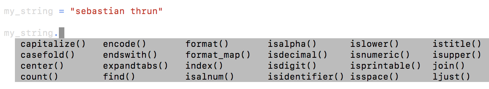

# Python

## String Methods


## Split

1. A basic split method:
>```Python
> new_str = "The cow jumped over the moon."
> new_str.split()```
> 
> Output is: ['The', 'cow', 'jumped', 'over', 'the', 'moon.']
>```

2. Here  the separator is space, and the maxsplit argument is set to 3.
>```Python
> new_str.split(' ', 3) ```
> 
> Output is: ['The', 'cow', 'jumped', 'over the moon.']
>```

3. Using '.' or period as a separator.
>```Python
> new_str.split('.')```
> 
> Output is: ['The cow jumped over the moon', '']
>```

4. Using no separators but having a maxsplit argument of 3.
>```Python
> new_str.split(None, 3)```
> 
> Output is: ['The', 'cow', 'jumped', 'over the moon.']
>```

## Data Structure

>```python
> Data Structure    |   Ordered    |    Mutable |   Constructor     |   Example
>-------------------+--------------+--------------+-----------------+-----------------------
>  List             |   Yes        |    YES     |   [ ] or list()   |   [5.7, 4, 'yes', 5.7]
>  Tuple            |   Yes        |    NO      |   ( ) or tuple()  |   (5.7, 4, 'yes', 5.7)
>  Set              |   NO         |    YES     |   {}* or set()    |   {5.7, 4, 'yes'}
>  Dictionary       |   NO         |    NO**    |   { } or dict()   |   {'Jun': 75, 'Jul': 89}
>```


### Lists and Membership Operators
>```Python
> months = ['January', 'February', 'March', 'April', 'May', 'June', 'July', 'August', 'September', 'October', 'November', 'December']
> print(months[0]) # January
> print(months[1]) # February
> print(months[7]) # August
> print(months[-1]) # December
> print(months[25]) # IndexError: list index out of range
> 
> q3 = months[6:9]
> print(q3) # [ 'July', 'August', 'September']
> 
> first_half = months[:6]
> print(first_half) # ['January', 'February', 'March', 'April', 'May', 'June']
> 
> second_half = months[6:]
> print(second_half) # ['July', 'August', 'September', 'October', 'November', 'December']
> 
>```

### Are you `in` OR `not in`?
>```Python
> >>> 'this' in 'this is a string'
> True
> >>> 'in' in 'this is a string'
> True
> >>> 'isa' in 'this is a string'
> False
> >> 5 not in [1, 2, 3, 4, 6]
> True
> >>> 5 in [1, 2, 3, 4, 6]
> False
>```

### Tuples
A tuple is another useful container. It's a data type for immutable ordered sequences of elements. They are often used to store related pieces of information. Consider this example involving latitude and longitude:

>```Python
> location = (13.4125, 103.866667)
> print("Latitude:", location[0])
> print("Longitude:", location[1])
>```

Tuples are similar to lists in that they store an ordered collection of objects which can be accessed by their indices. Unlike lists, however, tuples are immutable - you can't add and remove items from tuples, or sort them in place.

Tuples can also be used to assign multiple variables in a compact way.
>```Python
> dimensions = 52, 40, 100
> length, width, height = dimensions
> print("The dimensions are {} x {} x {}".format(length, width, height))
>```

### Sets
A set is a data type for mutable unordered collections of unique elements. One application of a set is to quickly remove duplicates from a list.

>```Python
> numbers = [1, 2, 6, 3, 1, 1, 6]
> unique_nums = set(numbers)
> print(unique_nums)
> This would output: {1, 2, 3, 6}
> 
> fruit = {"apple", "banana", "orange", "grapefruit"}  # define a set
> print("watermelon" in fruit)  # False -- check for element 
> 
> fruit.add("watermelon")  # add an element
> print(fruit) # {'grapefruit', 'orange', 'watermelon', 'banana', 'apple'}
> 
> print(fruit.pop())  # grapefruit -- remove a random element
> print(fruit) # {'orange', 'watermelon', 'banana', 'apple'}
>```

### Dictionaries and Identity Operators
>```Python
> elements = {"hydrogen": 1, "helium": 2, "carbon": 6}
> print("carbon" in elements)
> print(elements.get("dilithium"))
>```

# References
- document: document: https://peps.python.org/pep-0008/
